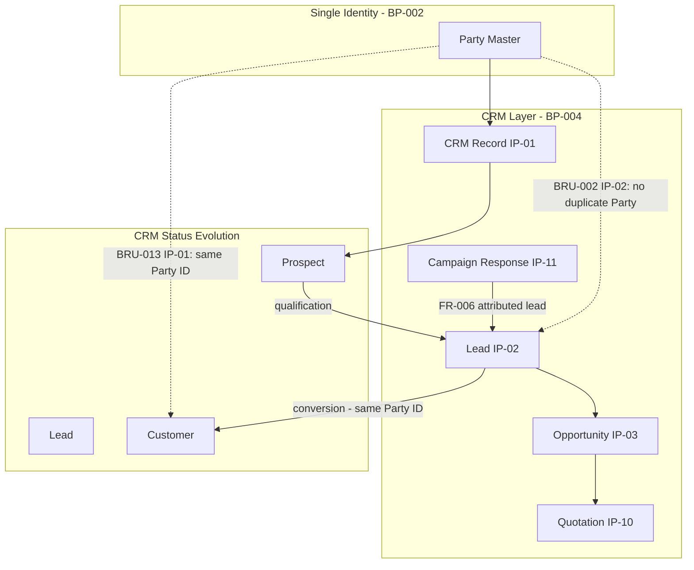
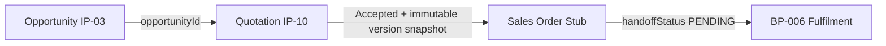
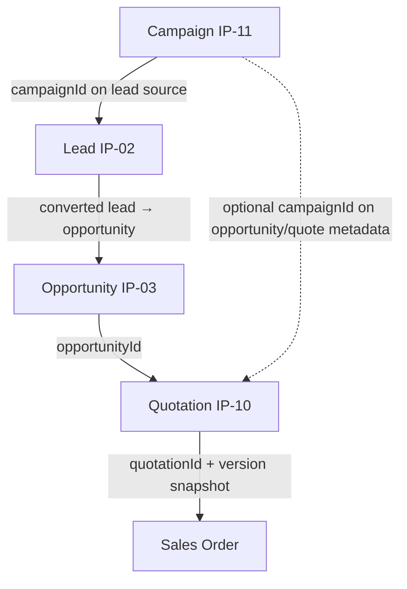

# BP-004 Sales & Marketing — Phase 0 Planning Report (Approved)

**Agent:** BP-004 Sales & Marketing Engineer  
**Branch:** `bp004-sales-marketing`  
**Assigned IPs:** IP-10 (Quotations & Sales Pipeline), IP-11 (Campaign Management), IP-12 (CRM Analytics & Dashboards)  
**Status:** Approved with amendments — implementation in progress  
**Final handover doc:** `sales-marketing-implementation.md` (**complete**)

---

## 1. Executive Summary

Planning is **approved**. Implementation proceeds **IP-10 → IP-11 → IP-12**, stopping after each IP passes quality gates. **IP-10**, **IP-11**, and **IP-12** are **complete**. Final remediation and `sales-marketing-implementation.md` handover are done — **Sales & Marketing domain READY TO FREEZE**.

CRM Core (IP-01, IP-03, IP-04 minimum) remains a prerequisite for full IP-10 integration; foreign-key references to CRM entities use UUID columns without DB constraints until CRM Core merges.

---

## 2. Implementation Sequence

```
Gate 0: CRM Core MVP (IP-01, IP-04)
    ↓
Gate 1: IP-03 Opportunity complete
    ↓
IP-10 Quotations (Phases 10.1–10.9)     ← STOP after IP-10
    ↓
Gate 2: IP-02 Lead + IP-08 Communication MVP
    ↓
IP-11 Campaigns (Phases 11.1–11.9)      ← STOP after IP-11
    ↓
Gate 3: IP-05–IP-09 sufficient for analytics
    ↓
IP-12 CRM Analytics (incremental phases) ← STOP after IP-12
    ↓
sales-marketing-implementation.md handover
```

---

## 3. Prospect → Lead → Customer Lifecycle

One Party ID persists across the entire CRM lifecycle. No duplicate Party or CRM records are created during conversion.



### Lifecycle Rules (No Duplicate Entities)

| Stage | Entity | Party ID | CRM Record | Notes |
|-------|--------|----------|------------|-------|
| Prospect | CRM record (status=Prospect) | Created once or matched | One per Party per business | Party may pre-exist from BP-002 |
| Lead | Lead (IP-02) | **Same Party ID** | Same CRM record; status may update | Lead conversion does not create new Party |
| Qualified lead | Lead (Qualified) | Same | Same | Assignment history via ENG-003n |
| Conversion | Account + Contact (IP-04) | Same | Status → Customer | Creates account/contact links, not new Party |
| Opportunity | Opportunity (IP-03) | Same | Linked to account | Pipeline independent of Party duplication |
| Quotation | Quotation (IP-10) | Same | Linked via crmRecordId + accountId + opportunityId | Pulls offerings from BP-003 |
| Campaign response | Lead (IP-02) | Same or matched | Campaign attribution on lead source | IP-11 never creates duplicate Party |

### Conversion Integrity Checklist

- [ ] Lead conversion calls Party match before create (IP-02 BRU-002)
- [ ] CRM record status transition, not CRM record recreation (IP-01 BRU-013)
- [ ] Quotation links to existing opportunity/account IDs only (IP-10 FR-001)
- [ ] Campaign lead creation passes `campaignId` as source, reuses Party if matched (IP-11 FR-006)
- [ ] All lifecycle events append to **one** Party Timeline (IP-01 BRU-015)

---

## 4. Customer 360 Contribution Matrix

IP-10, IP-11, and IP-12 **publish into** Customer 360 (IP-01). They do not implement the 360 shell.

### IP-10 — Quotations

| Contribution Type | ID / Code | Label (default) | Data Source | Phase |
|-------------------|-----------|-----------------|-------------|-------|
| **Widget** | `quotation.outstanding` | Outstanding Quotations | Open + Sent quotes for Party | 10.7 |
| **Widget** | `quotation.pending_acceptance` | Pending Acceptance | Sent, not yet accepted/rejected | 10.7 |
| **Widget** | `quotation.expired` | Expired Quotes | status=EXPIRED | 10.7 |
| **Insight** | `quotation.awaiting_response` | Quotation awaiting response | Latest Sent quote past N days | 10.7 |
| **Insight** | `quotation.total_quoted_value` | Total quoted value | Sum of open quote grand totals | 10.7 |
| **Timeline** | `QUOTATION_CREATED` | Quotation created | quotation + version 1 | 10.7 |
| **Timeline** | `QUOTATION_SENT` | Quotation sent | version locked + Sent | 10.7 |
| **Timeline** | `QUOTATION_ACCEPTED` | Quotation accepted | status=ACCEPTED | 10.7 |
| **Timeline** | `QUOTATION_REJECTED` | Quotation rejected | status=REJECTED | 10.7 |
| **Timeline** | `QUOTATION_EXPIRED` | Quotation expired | validUntil passed | 10.7 |
| **Timeline** | `QUOTATION_REVISED` | Quotation revised | new version created | 10.7 |
| **Quick Action** | `quotation.create_from_opportunity` | Create Quotation | From opportunity context | 10.8 |
| **Quick Action** | `quotation.view_latest` | View Latest Quotation | Navigate to workspace | 10.8 |
| **Tab** | `quotations` | Quotations | Dedicated workspace tab on Customer Profile | 10.8 |

### IP-11 — Campaigns

| Contribution Type | ID / Code | Label (default) | Data Source | Phase |
|-------------------|-----------|-----------------|-------------|-------|
| **Widget** | `campaign.active_memberships` | Active Campaigns | Member records for Party | 11.7 |
| **Widget** | `campaign.recent_responses` | Campaign Responses | Response count (90 days) | 11.7 |
| **Widget** | `campaign.last_touch` | Last Campaign Touch | Most recent response date | 11.7 |
| **Insight** | `campaign.response_rate` | Campaign response rate | Responded / Sent for Party | 11.7 |
| **Insight** | `campaign.attributed_leads` | Leads from campaigns | Count leads with campaign source | 11.7 |
| **Timeline** | `CAMPAIGN_RESPONSE` | Campaign response recorded | member status → Responded | 11.7 |
| **Timeline** | `CAMPAIGN_LEAD_ATTRIBUTED` | Lead attributed to campaign | lead created from response | 11.7 |
| **Timeline** | `CAMPAIGN_MEMBER_ADDED` | Added to campaign | member created | 11.7 |
| **Quick Action** | `campaign.log_response` | Log Campaign Response | Manual response capture | 11.8 |
| **Tab** | `campaigns` | Campaigns | Customer-scoped campaign membership list | 11.8 |

### IP-12 — CRM Analytics

| Contribution Type | ID / Code | Label (default) | Data Source | Phase |
|-------------------|-----------|-----------------|-------------|-------|
| **Tab** | `analytics` | Analytics | Customer-scoped KPI panel (distinct from executive dashboard) | 12.6 |
| **Widget** | `analytics.health_score` | Health Score | Rule-based composite score | 12.6 |
| **Widget** | `analytics.churn_risk` | Churn Risk Flag | ENG-004 / inline rules | 12.6 |
| **Widget** | `analytics.dormancy` | Dormancy Flag | Days since last activity | 12.6 |
| **Widget** | `analytics.relationship_value` | Relationship Value | Pipeline + quoted + won value | 12.6 |
| **Widget** | `analytics.open_pipeline` | Open Pipeline Value | IP-03 opportunities | 12.2 |
| **Widget** | `analytics.open_cases` | Open Cases | IP-09 (when available) | 12.4 |
| **Widget** | `analytics.last_visit` | Last Visit | IP-07 (when available) | 12.5 |
| **Insight** | `analytics.health_summary` | Health summary text | Rule-based summary for Insights panel | 12.6 |
| **KPI** | `kpi.pipeline_by_stage` | Pipeline by Stage | Aggregated opportunities | 12.2 |
| **KPI** | `kpi.weighted_forecast` | Weighted Forecast | Stage probability × amount | 12.2 |
| **KPI** | `kpi.win_rate` | Win Rate | Won / (Won + Lost) | 12.2 |
| **KPI** | `kpi.sales_cycle_days` | Sales Cycle Length | Opp created → won | 12.2 |
| **KPI** | `kpi.lead_conversion_rate` | Lead Conversion Rate | IP-02 funnel | 12.3 |
| **KPI** | `kpi.campaign_roi` | Campaign ROI | IP-11 cost vs pipeline | 12.3 |
| **KPI** | `kpi.case_sla_compliance` | Case SLA Compliance | IP-09 + ENG-003n | 12.9 |
| **KPI** | `kpi.visit_coverage` | Visit Coverage | IP-07 visits vs target accounts | 12.5 |
| **Quick Action** | `analytics.view_dashboard` | View CRM Dashboard | Navigate to executive dashboard | 12.7 |
| **Quick Action** | `analytics.export` | Export Analytics | CSV export for customer scope | 12.8 |

> **Future:** `analytics.ai_summary` widget (ENG-012) — Phase 2, excluded from v1.

---

## 5. External Integration Matrix

Planned integrations for inbound/outbound CRM data. v1 implements **adapter interfaces**; live connectors are phased.

| Integration | Direction | Owner IP | Use Case | v1 Treatment | Future Phase |
|-------------|-----------|----------|----------|--------------|--------------|
| **Contact Center** | Inbound | IP-02, IP-08 | Call disposition → lead/communication log | Adapter stub + manual log | Phase 2: webhook from CC platform |
| **Contact Center** | Outbound | IP-08, IP-11 | Click-to-call, campaign call lists | Deferred | Phase 2: CTI integration |
| **Social Media** | Inbound | IP-02 | Social lead capture (Facebook, LinkedIn, X) | API endpoint stub (`POST /api/crm/leads/social`) | Phase 2: OAuth + platform webhooks |
| **Social Media** | Outbound | IP-11 | Social campaign tracking | Campaign type=advertising; manual response | Phase 3: social API posting |
| **Institution Lead Systems** | Inbound | IP-02 | Bank/school/government lead feeds | Bulk import adapter + API (`POST /api/crm/leads/institution`) | Phase 2: scheduled SFTP/API sync |
| **Institution Lead Systems** | Outbound | IP-12 | Conversion reporting back to institution | Deferred | Phase 3: outbound reporting API |
| **CRM REST API** | Bidirectional | IP-10, IP-11 | Quotation CRUD, campaign CRUD | Server Actions v1; public API Phase 2 | OpenAPI documented endpoints |
| **CRM Webhooks** | Outbound | All | Quote accepted, lead converted events | Event registry stub | Phase 2: ENG-003e consumer |
| **Email/SMS Gateway** | Outbound | IP-08, IP-11 | Campaign and notification delivery | ENG-009 stub; manual send logging | Phase 2: ENG-009 engine |
| **Document/PDF Service** | Outbound | IP-10 | Quotation PDF generation | ENG-015 stub; HTML printable view | Phase 2: template engine |
| **Order/Fulfilment (BP-006)** | Outbound | IP-10 | Sales order handoff from accepted quote | Order stub record + handoff contract | BP-006 consumption |
| **Pricing (BP-003)** | Inbound | IP-10 | Live offering + price resolution | `PricingResolutionAdapter` | Canonical BP-003 consumer API |

### Adapter Interface Locations (planned)

```
03-platform/src/modules/crm/adapters/
├── pricing-resolution-adapter.ts      # IP-10 → BP-003
├── quotation-document-adapter.ts      # IP-10 → ENG-015
├── campaign-outreach-adapter.ts       # IP-11 → ENG-009
├── lead-ingestion-adapter.ts          # IP-02/IP-11 → external feeds
├── contact-center-adapter.ts          # IP-08 → CC platforms
└── crm-webhook-publisher.ts           # All → external subscribers
```

---

## 6. Incremental Analytics Plan (IP-12)

IP-12 is **not** a single end-of-BP delivery. Each phase ships independently and enriches dashboards as upstream IPs become available.

| Phase | Name | Deliverables | Minimum Dependencies | Ship When |
|-------|------|--------------|---------------------|-----------|
| **12.1** | Analytics framework | `crm_metric_definition`, `crm_metric_snapshot`, `CrmAnalyticsService` skeleton | IP-01 | **Complete** |
| **12.2** | Sales & pipeline | Pipeline by stage, weighted forecast, win rate, cycle time, deal size | IP-03, IP-10 | **Complete** (live quotes; opportunity KPIs pending IP-03) |
| **12.3** | Lead & campaign | Funnel by source/campaign, conversion velocity, campaign ROI | IP-02, IP-11 | **Complete** (campaign live; lead funnel pending IP-02) |
| **12.4** | Service & engagement | Case volume, resolution time; activity/communication frequency | IP-05, IP-08, IP-09 | **Complete** (graceful pending widgets) |
| **12.5** | Visit analytics | Visit frequency, rep coverage, open action items | IP-07 | **Complete** (graceful pending widgets) |
| **12.6** | Customer 360 Analytics tab | Customer-scoped KPIs, health score, dormancy/churn flags | 12.2 + party context | **Complete** |
| **12.7** | Executive dashboard | Role-based widget layout, branch/team/date filters | 12.2–12.6 (partial OK) | **Complete** |
| **12.8** | Drill-down & export | Navigate to filtered lists; CSV export | 12.7 | **Complete** |
| **12.9** | SLA & assignment analytics | Per-owner duration, breaches, queue delays | ENG-003n + IP-01 | **Complete** (section stub pending ENG-003n) |
| **12.10** | Quality gate | Smoke validation, lint, typecheck, build | All prior phases | **Complete** |

### MVP Analytics (first shippable increment)

Phases **12.1 + 12.2 + 12.7 (partial)** deliver a usable executive dashboard with sales KPIs before service/visit dimensions exist. Missing widgets degrade gracefully per IP-01 BRU-014.

---

## 7. IP-10 Implementation Phases

| Phase | Deliverable | Status |
|-------|-------------|--------|
| **10.1** | Schema, repositories, types, validators, lifecycle rules | **Complete** |
| **10.2** | BP-003 integration (`PricingResolutionAdapter`), `QuotationCalculationService` | **Complete** |
| **10.3** | Lifecycle service (Draft → Sent → Accepted/Rejected/Expired, versioning) | **Complete** |
| **10.4** | Sales order stub + opportunity linkage | **Complete** |
| **10.5** | Document output (ENG-015 adapter) | **Complete** |
| **10.6** | Approval path (ENG-005-ready) | **Complete** |
| **10.7** | Customer 360 widgets, insights, timeline | **Complete** |
| **10.8** | UI, navigation, workspace | **Complete** |
| **10.9** | Smoke validation, lint, typecheck, build | **Complete** |

---

## 8. IP-11 Implementation Phases

| Phase | Deliverable | Status |
|-------|-------------|--------|
| **11.1** | Campaign schema + foundation | **Complete** |
| **11.2** | Audience (party group reference) | **Complete** |
| **11.3** | Member management + consent check | **Complete** |
| **11.4** | Lead attribution (IP-02) | **Complete** |
| **11.5** | Outreach logging (IP-08) | **Complete** |
| **11.6** | ROI metrics | **Complete** |
| **11.7** | Customer 360 contribution | **Complete** |
| **11.8** | UI + navigation | **Complete** |
| **11.9** | Quality gate | **Complete** |

---

## 9. Deferred v1 Scope (Confirmed)

| Item | Resolution |
|------|------------|
| PDF generation (AC-005) | v1: structured record + printable HTML; PDF via ENG-015 Phase 2 |
| ENG-009 campaign blast | v1: manual send + status update |
| ENG-003n SLA analytics | Deferred to IP-12 Phase 12.9 |
| Dynamic segment rules (IP-11) | v1: party group reference only |
| CSAT metric | Omit unless IP-09 defines satisfaction capture |

---

## 10. Dependencies Summary

### Prerequisites (hard gates)

| IP | Requires |
|----|----------|
| IP-10 | IP-01, IP-03, IP-04, BP-003 IP-01 + IP-11 |
| IP-11 | IP-01, IP-02, IP-08, BP-002 IP-08 + IP-12 |
| IP-12 | IP-01–IP-11 (incremental by phase) |

### Platform engines

| Engine | IP-10 | IP-11 | IP-12 | v1 Treatment |
|--------|-------|-------|-------|--------------|
| ENG-003k | ✓ | ✓ | ✓ | Use existing |
| ENG-013 Audit | ✓ | ✓ | — | Use existing |
| ENG-005 Workflow | ✓ | — | — | Stub |
| ENG-015 Document | ✓ | — | — | Stub |
| ENG-009 Notifications | — | ✓ | — | Stub |
| ENG-011 Reporting | — | ✓ | ✓ | Inline analytics pattern |
| ENG-004 Rules | — | — | ✓ | Inline rules |
| ENG-003n SLA | Optional | Optional | 12.9 | Defer |

---

## 11. Module Structure

```
03-platform/src/modules/crm/
├── quotation/              # IP-10
│   ├── repositories/
│   ├── validators/
│   ├── types.ts
│   └── (services, actions, components — later phases)
├── campaign/               # IP-11
├── analytics/              # IP-12
├── adapters/
├── constants.ts
└── errors.ts
```

**Post-completion deliverable:** `sales-marketing-implementation.md` — full plan recap, component implementation matrix, and Integration Manager handover.

---

## 12. Pre-IP-11 Confirmations (IP-10 Approved)

Recorded before starting Campaign Management per Integration Manager review (9.6/10).

### 12.1 Quotation → Sales Order Handoff Contract



| Contract Element | Implementation | Notes |
|------------------|----------------|-------|
| Accepted quotation reference | `sales_order.quotation_id` (FK) | Required; one sales order per quotation |
| Immutable quotation snapshot | `sales_order.quotation_version_id` + copied line totals | Lines also store `quotation_line_id` |
| Generated sales order reference | `sales_order.order_number` (`SO-…`) | Returned to UI after convert |
| Opportunity continuity | `sales_order.opportunity_id` (UUID, no FK until IP-03) | Copied from quotation |
| Party / account continuity | `party_id`, `account_id`, `crm_record_id` | Same identity chain |
| Handoff status | `handoff_status` = `PENDING` → future `DISPATCHED` | BP-006 consumes stub |
| Opportunity stage callback | `OpportunityHandoffAdapter` (no-op stub) | IP-03 replaces stub |
| Quotation document snapshot | `quotation.document_snapshot` (HTML) | Locked printable view for audit |

**Rules**

1. Convert only when effective status is `ACCEPTED` and not past `valid_until`.
2. Quotation lines/version are already locked at Send; sales order copies amounts — does not re-price.
3. Duplicate convert blocked (`SALES_ORDER_ALREADY_EXISTS`).
4. Fulfilment, inventory, and invoicing remain **out of scope** for BP-004.

### 12.2 Quotation Validity & Automatic Expiry

| Capability | v1 Status | Behaviour |
|------------|-----------|-----------|
| Valid to (`valid_until`) | **Implemented** | Set on create (default +30 days) or explicit date |
| Valid from | **Implicit** | Effective start = `created_at`; send timestamp on version (`sent_at`). Explicit `valid_from` column deferred |
| Automatic expiry | **Implemented** | On read/search/convert: Sent + past `valid_until` → effective `EXPIRED` via `applyExpiryIfNeeded` |
| Manual expire | **Implemented** | `expireQuotation` transition |
| Stale convert blocked | **Implemented** | `canConvertQuotationToOrder` rejects expired |

### 12.3 Approval Routing Posture

| Layer | v1 | Target (ENG-005) |
|-------|----|------------------|
| Threshold gate | Module constant `DEFAULT_QUOTATION_APPROVAL_THRESHOLD` (100,000) | Business metadata / workflow config |
| Approval statuses | `NOT_REQUIRED` / `PENDING` / `APPROVED` / `REJECTED` | Same codes; workflow-owned transitions |
| Send gate | Requires `NOT_REQUIRED` or `APPROVED` | Unchanged |
| Multi-tier routing (Manager / Director) | **Not implemented** | ENG-005 workflow definition by amount bands |
| Approver identity | `approved_by` + audit | Workflow task assignee |

**Honest boundary:** Approval is **ENG-005-ready** (status model + hooks), not fully metadata-driven yet. Amount bands and role routing must come from Workflow Engine configuration before production multi-level approvals.

### 12.4 Quotation Acceptance Channels

| Channel | Code (planned) | v1 | Notes |
|---------|----------------|----|-------|
| Manual (agent workspace) | `MANUAL` | **Implemented** | `acceptQuotationAction` |
| Customer portal | `PORTAL` | Future | Same service method; channel metadata |
| Email reply / link | `EMAIL` | Future | Inbound adapter → accept |
| Public / partner API | `API` | Future | Server Action today; OpenAPI later |
| Digital signature | `E_SIGNATURE` | Future | ENG-015 / e-sign provider |

Acceptance always goes through `QuotationService.acceptQuotation` — channel is an attribution attribute, not a parallel lifecycle.

### 12.5 End-to-End Attribution Chain (Campaign → Order)



| Object | Retains Reference To |
|--------|----------------------|
| Campaign member | `campaign_id`, `party_id`, optional `lead_id` |
| Lead | `campaign_id` / source (IP-02) |
| Opportunity | `lead_id`, account, party (IP-03) |
| Quotation | `opportunity_id`, `account_id`, `crm_record_id`, `party_id` |
| Sales order | `quotation_id`, `quotation_version_id`, `opportunity_id`, `party_id` |

This chain enables marketing ROI: campaign cost → attributed leads → pipeline → accepted quotes → sales orders.

### 12.6 Non-blockers (Enhancements)

| Item | Status |
|------|--------|
| Version comparison UI | Deferred — versions persist; compare workspace not in v1 |
| Explicit `valid_from` column | Deferred — use `created_at` / `sent_at` |
| Multi-tier approval bands | Deferred to ENG-005 config |
