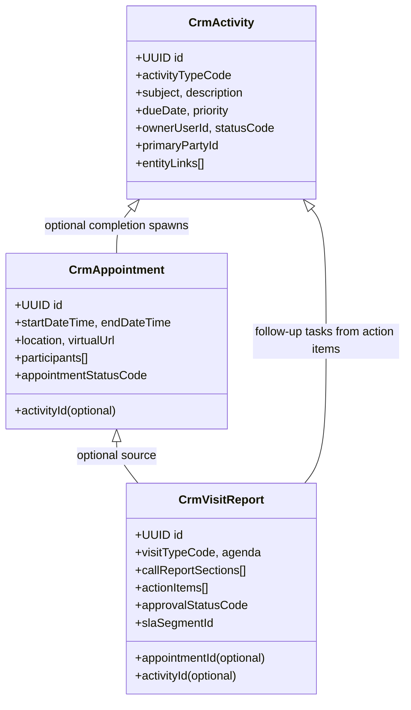
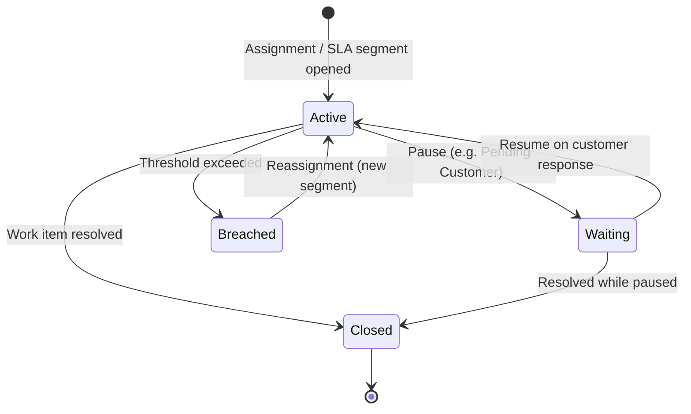

# BP-004 Service & Engagement — Implementation Plan & Handover

**Agent:** BP-004 Customer Service & Engagement Engineer  
**Branch:** `bp004-service-engagement`  
**Assigned IPs:** IP-05, IP-06, IP-07, IP-08, IP-09, IP-13  
**Architecture Version:** AV-1.6 (ENG-003n Work Assignment & SLA)  
**Overall assessment:** 9.5/10 — most mature planning report; refinements applied below before coding.

---

## 1. Phase 0 Planning Summary

### 1.1 Objective

Deliver CRM service and engagement capabilities — activities, calendar, visits, communications, cases, and governance — consuming platform engines and feeding Customer 360 without duplicating CRM Core (IP-01) or Party master data (BP-002).

### 1.2 Approved implementation sequence

| Order | IP | Name | Status |
|-------|-----|------|--------|
| 1 | IP-05 | Activity & Task Management | **FROZEN** (final remediation applied) |
| 2 | IP-06 | Calendar & Appointment Management | **FROZEN** (final remediation applied) |
| 3 | IP-07 | Visit & Call Report Management | **FROZEN** (final remediation applied) |
| 4 | IP-08 | Communication Management | **FROZEN** (final remediation applied) |
| 5 | IP-09 | Case & Service Request Management | **FROZEN** (final remediation applied) |
| 6 | IP-13 | CRM Governance & Administration | **Complete** (admin unchanged by SE remediation) |

> **Sequence note (approved):** Activity → Appointment → Visit → Communications → Cases. IP-07 precedes IP-08.

### 1.3 Prerequisites (gate zero)

| Dependency | Owner | Required before |
|------------|-------|-----------------|
| IP-01 CRM Foundation & Customer 360 | CRM Core agent | Customer 360 widget registration (IP-05 widgets stub-ready) |
| IP-04 Customer & Contact Management | CRM agent | Full entity linkage (Party linkage sufficient for IP-05 v1) |
| ENG-003n Work Assignment & SLA | Platform | IP-07, IP-09, IP-13 |
| ENG-005 Workflow | Platform | IP-07, IP-09, IP-13 |
| ENG-009 Notifications | Platform | Production AC for reminders (audit-log fallback v1) |

---

## 2. Activity → Appointment → Visit Model

Scheduling logic is **composed, not duplicated**. Each layer extends the prior without re-implementing scheduling primitives.



### Composition rules

| Layer | Owns | Reuses from parent | Does not duplicate |
|-------|------|--------------------|--------------------|
| **Activity (IP-05)** | Task/call/email/note types, due dates, assignment, completion outcomes | — | Calendar views, visit minutes, communication transport |
| **Appointment (IP-06)** | Start/end, participants, location, reminders, no-show | IP-05 activity on completion; shared `primaryPartyId` + entity links | Visit report sections, SLA on report submission |
| **Visit (IP-07)** | Collaborative call report, action items, documents (deferred), approval, report SLA | IP-06 appointment reference via `linkedAppointmentId` (Visit → Appointment only); IP-05 tasks from approved action items | Calendar availability, resource booking; bidirectional appointment ownership |

### Shared identifiers

- **`primaryPartyId`** — required on all three; drives Party Timeline publication.
- **`entityLinks[]`** — polymorphic `{ entityTypeCode, entityId }` for CRM record, account, lead, opportunity, case.
- **`ownerUserId`** — current assignee; reassignment history via ENG-003n when SLA enabled.

### Lifecycle handoff

```
Activity (scheduled work item)
    ↓ meeting type + due window
Appointment (time-boxed engagement)
    ↓ held → complete → spawns completed Activity
Visit Report (structured documentation + approval)
    ↓ approved → action items → IP-05 Tasks
```

---

## 3. Customer 360 Contribution Matrix

All Service & Engagement IPs **feed** Customer 360 (IP-01 owns the hub); they do not implement separate profile experiences.

### Stable contribution widget IDs (final remediation)

| IP | Stable widget IDs |
|----|-------------------|
| IP-05 | `recent-activities`, `open-tasks`, `overdue-tasks`, `upcoming-activities` |
| IP-06 | `upcoming-appointments`, `recent-appointments` (IP-01 insight alias “next appointment” → `upcoming-appointments[0]`) |
| IP-07 | `upcoming-visits`, `recent-visits`, `open-call-report-actions`, `pending-visit-approvals` |
| IP-08 | `recent-communications`, `last-interaction-channel` |
| IP-09 | `open-cases`, `sla-at-risk`, `breached-cases`, `recent-cases`, `escalated-cases`, `last-complaint` |

### IP-05 — Activities & Tasks

| Contribution type | ID / code | Description | Quick action |
|-------------------|-----------|-------------|--------------|
| Widget | `recent-activities` | Latest customer activities | Log activity |
| Widget | `open-tasks` | Open / in-progress activities | — |
| Widget | `overdue-tasks` | Past-due open activities | View overdue |
| Widget | `upcoming-activities` | Future-due open activities | — |
| Insight | `next-follow-up` | Earliest open task due date | — |
| Timeline | `ACTIVITY_CREATED` / `COMPLETED` / `OVERDUE` / `CANCELLED` / `DEFERRED` | Activity lifecycle | — |
| Quick action | `log-activity` | Create activity pre-linked to customer | — |

### IP-06 — Calendar & Appointments

| Contribution type | ID / code | Description | Quick action |
|-------------------|-----------|-------------|--------------|
| Widget | `upcoming-appointments` | Scheduled future appointments | Open calendar |
| Widget | `recent-appointments` | Recent appointments | — |
| Insight alias | `next-appointment` | Maps to `upcoming-appointments[0]` | — |
| Timeline | `APPOINTMENT_*` | Schedule / complete / cancel / no-show | — |
| Quick action | `schedule-appointment` | Pre-filled customer context | — |

### IP-07 — Visits & Call Reports

| Contribution type | ID / code | Description | Quick action |
|-------------------|-----------|-------------|--------------|
| Widget | `upcoming-visits` | Future non-cancelled visits | — |
| Widget | `recent-visits` | Latest visit / call reports | Open Visits |
| Widget | `open-call-report-actions` | Open action items from reports | — |
| Widget | `pending-visit-approvals` | Reports awaiting review | — |
| Timeline | `VISIT_*` / `CALL_REPORT_*` | Visit / approval lifecycle | — |

### IP-08 — Communications

| Contribution type | ID / code | Description | Quick action |
|-------------------|-----------|-------------|--------------|
| Widget | `recent-communications` | Recent communication log list | Open Communications |
| Widget | `last-interaction-channel` | Most recent channel summary | — |
| Timeline | `COMMUNICATION_SENT` / `RECEIVED` / `BLOCKED` | Log events | — |
| Quick action | `log-communication` | Manual log entry | — |

### IP-09 — Cases & Service Requests

| Contribution type | ID / code | Description | Quick action |
|-------------------|-----------|-------------|--------------|
| Widget | `open-cases` | Active case count / list | Open Cases |
| Widget | `sla-at-risk` | Open cases within 4h of due | — |
| Widget | `breached-cases` | Open cases past SLA | — |
| Widget | `recent-cases` | Recently opened cases | — |
| Widget | `escalated-cases` | Currently escalated | — |
| Widget | `last-complaint` | Most recent complaint | — |
| Timeline | `CASE_OPENED` / `ESCALATED` / `RESOLVED` / `CLOSED` | Case lifecycle | — |
| Quick action | `create-case` | Pre-filled customer context | — |

---

## 4. Omnichannel Communication Matrix

IP-08 owns the **communication log**; transport is platform-owned (ENG-009 / ENG-003d).

| Channel | Direction | v1 scope | Consent check (BP-002) | Transport owner | Future |
|---------|-----------|----------|------------------------|-----------------|--------|
| **Email** | Inbound / Outbound | Manual log + template reference | Required outbound | ENG-009 | Gmail/Outlook via ENG-003d |
| **Phone** | Inbound / Outbound | Manual log + duration | N/A inbound | ENG-009 click-to-call hook | Contact centre CTI |
| **SMS** | Inbound / Outbound | Manual log | Required outbound | ENG-009 | Twilio / regional gateways |
| **WhatsApp** | Inbound / Outbound | Manual log | Required outbound | ENG-009 | WhatsApp Business API |
| **Letter** | Outbound | Manual log | Optional | — | Print/mail integration |
| **In-person** | N/A | Manual log linked to visit/activity | N/A | — | — |
| **Contact Centre** | Inbound / Outbound | — | Required | ENG-003d | ACD/IVR webhook ingestion |
| **Social Media** | Inbound / Outbound | — | Required | ENG-003d | Facebook, X, LinkedIn DM |
| **Web / Portal** | Inbound | — | N/A | ENG-003d | Customer portal forms |
| **API / Webhook** | Inbound / Outbound | — | Per channel config | ENG-003e | Partner system integration |

### Logging model (consistent across channels)

```
channelTypeCode + direction + timestamp + summary
    → consent check (outbound)
    → ENG-009 send (when integrated)
    → communication_log entry
    → entity links (party, account, case, …)
    → Party Timeline event
    → optional IP-05 follow-up task
```

---

## 5. Detailed SLA Lifecycle

**Ownership (final remediation):** ENG-003n is the future authoritative SLA engine. IP-13 `crm_sla_policy` is the v1 config source when present. IP-09 stores interim due/pause/breach clocks on `crm_case` — **no competing permanent SLA engine**.

```
IP-13 crm_sla_policy (CASE + priority | CASE + null)
        ↓ resolve at createCase
IP-09 crm_case due timestamps (v1 interim clock)
        ↓ later
ENG-003n segments / remainingMs / business-hours (FUTURE)
```

Resolution order for case hours: (1) active `crm_sla_policy` for CASE+priority, (2) fallback `crm_case_priority` catalogue hours. Soft `sla_policy_id` on case when policy found.

All SLA/TAT measurement **will** consume ENG-003n; CRM modules never introduce parallel permanent SLA engines.

### States



### Segment model (ENG-003n)

| Field | Description |
|-------|-------------|
| `segmentId` | Immutable per assignee stint |
| `assigneeUserId` | Current or historical owner |
| `startedAt` / `endedAt` | Segment boundaries |
| `activeDurationMs` | Working time (excludes pause) |
| `waitingDurationMs` | Paused time |
| `elapsedDurationMs` | Wall-clock segment time |
| `slaPolicyId` | Bound policy reference |
| `slaTargetMs` | Configured threshold |
| `remainingMs` | Computed at query time |
| `breachedAt` | Null until breach |
| `breachDurationMs` | Time beyond target |

### Pause / resume

| Pause reason | Used by | Effect |
|--------------|---------|--------|
| `PENDING_CUSTOMER` | IP-09 cases | Stops active clock; case status = Pending Customer |
| `AWAITING_APPROVAL` | IP-07 visit reports | Reviewer segment separate from author segment |
| `LEGAL_HOLD` | IP-09, IP-13 | Configurable freeze |
| `AWAITING_THIRD_PARTY` | IP-09 | External dependency |

### Escalation history

1. ENG-003n emits `SLA_BREACHED` event.
2. ENG-005 escalation workflow triggered (role/queue routing).
3. Reassignment creates **new segment**; prior segment closed with breach flag preserved.
4. ENG-009 notifies supervisor + prior owner.
5. Immutable escalation history: `{ timestamp, fromOwner, toOwner, reason, triggeredBy: SYSTEM|MANUAL }`.

### Entity-specific SLA policies (configured in IP-13, consumed by entity IPs)

| Entity type | SLA examples | Pause states |
|-------------|--------------|--------------|
| Case (IP-09) | First response, resolution by priority | Pending Customer |
| Visit report (IP-07) | Report due after visit completion | Awaiting approval |
| Activity (IP-05) | Optional owner TAT when ENG-003n enabled | — |
| Lead (IP-02) | Qualification TAT | — |

---

## 6. Task & Action Item Model

Two related but distinct constructs unify under IP-05 for execution tracking.

### 6.1 CRM Activity / Task (IP-05)

General-purpose work items: calls, emails, follow-ups, notes.

| Attribute | Description |
|-----------|-------------|
| Owner | `ownerUserId` (platform user) |
| Due | `dueDate` |
| Status | OPEN → COMPLETED / CANCELLED / DEFERRED |
| Source | MANUAL, RULE_TRIGGERED, VISIT_ACTION_ITEM, CASE_ACTION |
| Reminder | ENG-009 overdue notification |

### 6.2 Visit Action Item (IP-07 → IP-05 handoff)

Structured items from approved call reports.

```
Visit Report (IP-07) action item
    → on approval: optional promote to IP-05 Task
    → sourceReference: { type: VISIT_ACTION_ITEM, id }
    → owner scoped: only assigned owner may update
    → due date + priority from report defaults
    → reminder via ENG-009
    → completion updates visit action item status
    → Customer 360: open-call-report-actions widget
```

### 6.3 Case-Derived Tasks (IP-09 → IP-05)

Case activities and follow-ups spawn IP-05 tasks with `sourceReference: { type: CASE, id }`.

### 6.4 Customer 360 surfacing

| Surface | Content |
|---------|---------|
| Widget `tasks-due` | Open IP-05 tasks + promoted visit action items |
| Widget `open-call-report-actions` | IP-07 items not yet promoted or still open |
| Insight `next-follow-up` | MIN(dueDate) across open tasks |
| Timeline | ACTIVITY_* events; visit/case source in metadata |
| Quick actions | Log activity, complete task |

### 6.5 Assignment & reminder flow

```
Create / promote task
    → assign owner + due date
    → optional ENG-003n segment (when SLA enabled)
    → ENG-009 schedule reminder (due - threshold)
    → on overdue: ACTIVITY_OVERDUE timeline + notification
    → on complete: close segment, publish ACTIVITY_COMPLETED
```

---

## 7. Component Implementation Matrix

Updated as each IP completes.

### IP-05 — Activity & Task Management

| Layer | Component / artifact | Path | Status |
|-------|---------------------|------|--------|
| Migration | `0042_bp004_ip005_activity_task_management.sql` | `drizzle/` | ✅ |
| Schema | `crm_activity`, `crm_activity_entity_link` | `src/db/schema/` | ✅ |
| Repository | Activity + entity link repositories | `src/modules/crm-activity/repositories/` | ✅ |
| Service | `CrmActivityService` | `src/modules/crm-activity/services/` | ✅ |
| Rules | `crm-activity-rules.ts` | `src/modules/crm-activity/services/` | ✅ |
| Validators | Zod schemas | `src/modules/crm-activity/validators/` | ✅ |
| Actions | Server actions | `src/modules/crm-activity/actions/` | ✅ |
| UI | Dashboard, workspace, registration form | `src/modules/crm-activity/components/` | ✅ |
| Routes | List, new, detail | `src/app/(authenticated)/(app)/crm/activities/` | ✅ |
| Timeline | ACTIVITY_* event types | `src/core/party-timeline/constants.ts` | ✅ |
| Audit | `crm_activity` entity | `src/core/audit/constants.ts` | ✅ |
| Nav | Activities entry | `src/lib/navigation/platform-nav-config.ts` | ✅ |
| Smoke | Validation script | `scripts/bp004-ip005-activity-task-smoke-validation.ts` | ✅ |
| Customer 360 | Widget contract export | `src/modules/crm-activity/customer-360-contribution.ts` | ✅ |

### IP-06 — Calendar & Appointment Management

| Layer | Component / artifact | Path | Status |
|-------|---------------------|------|--------|
| Migration | `0044_bp004_ip006_calendar_appointment_management.sql` | `drizzle/` | ✅ |
| Schema | `crm_appointment`, participants, entity links, catalogues | `src/db/schema/` | ✅ |
| Repository | Appointment + participant + entity link + catalogue | `src/modules/crm-appointment/repositories/` | ✅ |
| Service | `CrmAppointmentService` (consumes IP-05 on completion) | `src/modules/crm-appointment/services/` | ✅ |
| Validators | Zod schemas | `src/modules/crm-appointment/validators/` | ✅ |
| Actions | Server actions | `src/modules/crm-appointment/actions/` | ✅ |
| UI | Dashboard, workspace, registration form | `src/modules/crm-appointment/components/` | ✅ |
| Routes | List, new, detail | `src/app/(authenticated)/(app)/crm/appointments/` | ✅ |
| Timeline | APPOINTMENT_* event types | `src/core/party-timeline/constants.ts` | ✅ |
| Audit | `crm_appointment` entity | `src/core/audit/constants.ts` | ✅ |
| Nav | Calendar entry | `src/lib/navigation/platform-nav-config.ts` | ✅ |
| Smoke | Validation script | `scripts/bp004-ip006-calendar-appointment-smoke-validation.ts` | ✅ |
| Customer 360 | Widget contract export | `src/modules/crm-appointment/customer-360-contribution.ts` | ✅ |

### IP-07 — Visit & Call Report Management

| Layer | Component / artifact | Path | Status |
|-------|---------------------|------|--------|
| Migration | `0046_bp004_ip007_visit_call_report_management.sql` | `drizzle/` | ✅ |
| Schema | visit, participants, attendees, action items, docs, catalogues | `src/db/schema/` | ✅ |
| Service | `CrmVisitService` (approval + IP-05 promote) | `src/modules/crm-visit/services/` | ✅ |
| UI / Routes | Dashboard, workspace, registration | `/crm/visits` | ✅ |
| Nav | Visits entry | `platform-nav-config.ts` | ✅ |
| Smoke | Validation script | `scripts/bp004-ip007-visit-call-report-smoke-validation.ts` | ✅ |

---

## 8. IP-05 Implementation Handover — Approved with Refinements

**Status:** Complete (refinements applied)  
**Migrations:** `0042` activity tables, `0043` metadata catalogues  
**Branch:** `bp004-service-engagement`

### Refinement confirmation matrix

| Requirement | Coverage |
|-------------|----------|
| **Configurable Activity Types** | `crm_activity_type` metadata table + seed (Call, Meeting, Visit, Task, Follow-up, Email, Reminder, Document Review, Approval, Note, Other). Service loads catalogues from DB; `requiresCompletionNotes` flag per type. |
| **Configurable Status lifecycle** | `crm_activity_status` metadata table + seed: Planned, Assigned, In Progress, Waiting, Completed, Cancelled, Deferred. **Overdue** is a computed indicator (`isOverdue`), not a stored status. |
| **Configurable Priorities** | `crm_activity_priority` metadata table + seed: Low, Normal, High, Urgent. |
| **Business rules** | Enforced in `crm-activity-rules.ts` + service: completed read-only; due date ≥ activity date; inactive owner blocked; overdue/type-mandatory completion notes; entity link required. Documented in `CRM_ACTIVITY_BUSINESS_RULES`. |
| **Customer 360 widgets** | `getCustomer360Contribution()` returns **Recent Activities**, **Open Tasks**, **Overdue Tasks**, **Upcoming Activities** (+ counts). Contract in `customer-360-contribution.ts`. |
| **Party picker readiness** | `CrmActivityPartyLookupPort` + `createCrmActivityPartyLookupAdapter` (BP-002 Party search). Form still uses Party UUID until IP-04 picker UI. |
| **Bulk activities (future)** | Architecture documented in `CRM_ACTIVITY_BULK_ARCHITECTURE` — batch create/assign via service `createMany` pattern; not implemented in v1. |

### Stop gate

**IP-05 approved.** IP-06 implemented.

---

## 8b. IP-06 Implementation Handover

**Status:** Complete  
**Migration:** `0044_bp004_ip006_calendar_appointment_management.sql`  
**Branch:** `bp004-service-engagement`

### Delivered capabilities

| Requirement | Coverage |
|-------------|----------|
| **Appointment CRUD** | Create, reschedule (update), cancel, complete, no-show via `CrmAppointmentService` |
| **Metadata catalogues** | `crm_appointment_type` + `crm_appointment_status` (Scheduled, Completed, Cancelled, No-show) |
| **Participants** | Internal users + external BP-002 party contacts via `crm_appointment_participant` |
| **Calendar views** | Dashboard with week view; list filters MY / UPCOMING / ALL |
| **IP-05 handoff** | Completion spawns completed activity with `APPOINTMENT` record source; no-show optionally creates follow-up task |
| **Customer 360** | `getCustomer360Contribution()` — upcoming + recent appointments |
| **Party picker readiness** | Reuses `CrmAppointmentPartyLookupPort` (BP-002 adapter) |
| **Reminders** | Architecture stub (`CRM_APPOINTMENT_REMINDER_ARCHITECTURE`); ENG-009 integration deferred |
| **Timeline & audit** | `APPOINTMENT_*` events; `crm_appointment` audit entity |

### Stop gate

**IP-06 approved** with refinements applied (recurrence/resource/calendar architecture docs, conflict detection, lightweight minutes). Proceeding to IP-07.

### IP-06 refinements applied

| Item | Coverage |
|------|----------|
| Recurring appointments | Architecture in `CRM_APPOINTMENT_RECURRENCE_ARCHITECTURE`; columns `recurrenceRuleId`, `occurrenceIndex` reserved |
| Resource scheduling | Architecture in `CRM_APPOINTMENT_RESOURCE_ARCHITECTURE` (rooms, vehicles, equipment, branch) |
| Conflict / availability | `findOwnerConflicts` + `checkAvailability` + create-time conflict block with suggested slots |
| External calendars | Architecture in `CRM_APPOINTMENT_EXTERNAL_CALENDAR_ARCHITECTURE`; `externalCalendarSyncKey` reserved |
| Lightweight minutes | Fields `meetingNotes`, `decisions`, `actionItemsSummary` + UI + `updateMinutes` |
| Outcome statuses | Catalogue expanded: Held, Rescheduled, Partially Completed, Declined |

---

## 8c. IP-07 Implementation Handover

**Status:** Complete  
**Migration:** `0046_bp004_ip007_visit_call_report_management.sql`  
**Branch:** `bp004-service-engagement`

### Delivered capabilities

| Requirement | Coverage |
|-------------|----------|
| Visit CRUD + report sections | Collaborative agenda/discussion/decisions/risks/next steps/minutes |
| Participants & attendees | Internal participants + customer attendees |
| Action items | Owner/due/priority; promote to IP-05 tasks on approval |
| Approval workflow | Local DRAFT→SUBMITTED→APPROVED/RETURNED/REJECTED (ENG-005 stub) |
| Appointment link | Optional `linkedAppointmentId` (Visit → Appointment; not bidirectional) |
| Documents | Schema `crm_visit_document` exists; **upload/create DEFERRED** until ENG-015 |
| SLA | `reportDueAt` stub (24h); ENG-003n architecture documented |
| Customer 360 | Recent visits, open actions, pending approvals |
| Timeline | VISIT_* / CALL_REPORT_* events |

### Stop gate

**IP-07 approved.** IP-08 implemented.

---

## 8d. IP-08 Implementation Handover

**Status:** Complete  
**Migration:** `0047_bp004_ip008_communication_management.sql`  
**Branch:** `bp004-service-engagement`

### Delivered capabilities

| Requirement | Coverage |
|-------------|----------|
| Communication log | Manual inbound/outbound across Email, Phone, SMS, WhatsApp, Letter, In-person |
| Consent check | BP-002 `party_communication_preference` channel flags; block/warn/allow |
| Thread grouping | `threadId` self-link + workspace thread list |
| Append-only corrections | Addendum entries via `addendumToId` |
| Optional IP-05 follow-up | Checkbox creates activity from communication |
| ENG-009 transport | Architecture stub (`CRM_COMMUNICATION_TRANSPORT_ARCHITECTURE`) |
| Customer 360 | Last channel, recent count, recent list |
| Timeline | `COMMUNICATION_SENT` / `RECEIVED` / `BLOCKED` |

### Stop gate

**IP-08 complete.** Await approval before IP-09 Case & Service Request Management.

---

## 8e. IP-09 Implementation Handover

**Status:** Complete  
**Migration:** `0048_bp004_ip009_case_service_request_management.sql`  
**Branch:** `bp004-service-engagement`

### Delivered capabilities

| Requirement | Coverage |
|-------------|----------|
| Case registration | Types ENQUIRY / COMPLAINT / FEEDBACK / SERVICE_REQUEST / QUERY / INCIDENT / INVESTIGATION / FOLLOW_UP; CSE-###### numbering |
| Priority & severity | Catalogue-driven; HIGH/CRITICAL severity requires immediate owner |
| Status lifecycle | NEW → OPEN → PENDING_CUSTOMER / ESCALATED → RESOLVED → CLOSED; governed reopen |
| Assignment & queue | Nullable owner for QUEUE view; assign NEW→OPEN |
| SLA (ENG-003n interim) | Policy from IP-13 `crm_sla_policy` first, else priority hours; pause on PENDING_CUSTOMER; breach + auto-escalate; escalationLevel++; views expose slaRemainingMs / isSlaAtRisk / isSlaBreached |
| Escalation history | Immutable `crm_case_escalation` (SYSTEM\|MANUAL); ENG-009 contract documented |
| Resolution & close | Resolution summary + code; optional satisfaction 1–5 on close; `CASE_CLOSED` timeline |
| IP-05 follow-up | Optional CASE_ACTION activity with entity link CASE |
| Queue views | MY / QUEUE / OVERDUE / ESCALATED / ALL |
| Customer 360 | open-cases, sla-at-risk, breached-cases, recent-cases, escalated-cases, last-complaint |
| Timeline | `CASE_OPENED` / `CASE_ESCALATED` / `CASE_RESOLVED` / `CASE_CLOSED` |

### Stop gate

**IP-09 complete.** IP-13 implemented.

---

## 8f. IP-13 Implementation Handover

**Status:** Complete  
**Migration:** `0049_bp004_ip013_crm_governance.sql`  
**Branch:** `bp004-service-engagement`

### Architecture note

Governance is keyed by **`party_id`** (Customer Profile subject). IP-01 CRM Core will later add `crm_record_id`. Service Engagement does **not** implement `crm_record`. ENG-003l / ENG-003n / ENG-005 are local foundations + stubs only (same pattern as BP-003 offering governance).

### Delivered capabilities

| Requirement | Coverage |
|-------------|----------|
| Ownership | `ownerUserId`, `relationshipManagerUserId`, `stewardUserId` (platform users) |
| Ownership history | `crm_governance_ownership_history` with effectiveFrom/effectiveTo |
| Readiness checklist | Local ENG-003l table + evaluators (party identity, owners, activities, case hygiene; consent/CRM record pending stubs) |
| Governance score | Calculated readiness; not editable |
| Lock | `isLocked` blocks edits during pending approval |
| Duplicate → merge | `crm_merge_proposal` queue; execute stub marks EXECUTED without deleting parties (BP-002 owns merge) |
| SLA policies | CASE priorities + VISIT_REPORT / ACTIVITY defaults; APPOINTMENT admin via UI |
| Business hours / holidays | Seeded Mon–Fri 09:00–17:00; holiday CRUD stub |
| Approval matrix | MERGE / ACTIVATION / REOPEN_CASE / ARCHIVE stub |
| Dashboard | Missing owners, low scores, merge queue, SLA/hours/holidays/matrix |
| Customer 360 | Settings contribution IDs only (no hub widgets) |
| Timeline + audit | GOVERNANCE_* / MERGE_PROPOSED; CRM_GOVERNANCE / CRM_MERGE_PROPOSAL / CRM_SLA_POLICY |

### Stop gate

**IP-13 complete.** All Service Engagement assigned IPs (IP-05–IP-09, IP-13) are delivered. Stop after IP-13.

---

## 9. Remaining IP Handover Placeholders

None — Service Engagement assigned IPs are complete.

---

## 10. Final Remediation Closure

**Migration:** `0050_bp004_se_final_remediation.sql` (journal idx 50)  
**Scope:** IP-05–09 frozen after remediation. No redesign. No parallel engines. No IP-13 admin UI/seed changes beyond `findActiveForEntity`. No WhatsApp/self-service/CSAT/ENG runtimes.

### Association semantics

| Pattern | Used by | Meaning |
|---------|---------|---------|
| `entity_link` | activity, appointment, visit, communication, case | Polymorphic CRM context |
| `linkedAppointmentId` | visit | Visit references appointment (Visit → Appointment; not bidirectional) |
| `linkedActivityId` | appointment, visit, communication, visit_action_item | Completion / follow-up pointer |
| `sourceReferenceType` / `sourceReferenceId` | activity | Provenance from visit / case / appointment / communication |
| `linkedCommunicationId` | case | Case origin communication |

### Cross-IP dependencies

| From | To | Dependency |
|------|-----|------------|
| IP-06 | IP-05 | Completion / no-show may spawn activity |
| IP-07 | IP-06 | Optional `linkedAppointmentId` |
| IP-07 | IP-05 | Approved action items → tasks |
| IP-08 | BP-002 | Consent / channel prefs (`party_communication_preference`) |
| IP-08 | IP-05 | Optional follow-up activity |
| IP-09 | IP-13 | `crm_sla_policy` as SLA config source |
| IP-09 | IP-05 | Optional CASE_ACTION follow-up |
| IP-05–09 | IP-01 | Customer 360 hub contributions only |
| IP-05–09 | BP-002 | `primaryPartyId` + Party Timeline |

### Per-IP closure tables

#### IP-05 Activity & Task

| Status | Items |
|--------|-------|
| **IMPLEMENTED** | CRUD, catalogues, entity links, overdue emission (`ACTIVITY_OVERDUE` once via `overdue_event_emitted_at`), Customer 360 widgets, VISIT/APPOINTMENT entity type codes |
| **DEFERRED** | Bulk create, ENG-003n assignee TAT |
| **DEPENDENCY** | IP-01 hub; BP-002 party |
| **FUTURE** | Self-service task portal |

#### IP-06 Appointment

| Status | Items |
|--------|-------|
| **IMPLEMENTED** | CRUD, participants, conflicts, minutes, Customer 360 upcoming/recent |
| **DEFERRED** | Recurrence runtime, resource booking, external calendar sync, ENG-009 reminders |
| **DEPENDENCY** | IP-05 activity spawn; IP-01 hub |
| **FUTURE** | Full calendar provider sync |

#### IP-07 Visit

| Status | Items |
|--------|-------|
| **IMPLEMENTED** | Collaborative report, action items→IP-05, approval stub, upcoming-visits widget, Visit→Appointment link |
| **DEFERRED** | Document upload (`crm_visit_document` schema only; ENG-015) |
| **DEPENDENCY** | IP-06 link; IP-05 tasks; ENG-005 approval later |
| **FUTURE** | CSAT after visit, field app |

#### IP-08 Communication

| Status | Items |
|--------|-------|
| **IMPLEMENTED** | Manual log, consent check (channel flags), recent-communications widget, prefs architecture note |
| **DEFERRED** | preferredLanguage / contact time / marketingConsent consumption; future channel catalogue rows |
| **DEPENDENCY** | BP-002 prefs master; ENG-009 transport later |
| **FUTURE** | WhatsApp Business API, contact centre, social, web portal, CSAT surveys |

#### IP-09 Case

| Status | Items |
|--------|-------|
| **IMPLEMENTED** | Expanded types, subcategoryCode, SLA policy resolve + due clocks, escalationLevel, CASE_CLOSED, Customer 360 SLA widgets, SLA view helpers |
| **DEFERRED** | Business-hours clocks, per-assignee segments, ENG-003n remainingMs, ENG-009 notify runtime |
| **DEPENDENCY** | IP-13 `crm_sla_policy`; ENG-003n future; ENG-009 notify consumers |
| **FUTURE** | CSAT engine, self-service case portal, AI triage |

#### Explicitly FUTURE (out of SE remediation)

- CSAT / satisfaction engines beyond optional close rating field  
- Customer self-service portals  
- AI triage / auto-classification  
- WhatsApp / social / contact-centre **runtime** transports  
- Full ENG-003n / ENG-009 / ENG-015 production runtimes  

### SLA ownership (text diagram)

```
authoritativeEngine (future): ENG-003n
policyAdmin (v1):             IP-13 crm_sla_policy
v1InterimClock:               crm_case due / pause / breach / escalationLevel
views:                        computeSlaRemainingMs / isSlaAtRisk / isSlaBreached
notify contract:              CASE_ESCALATED + breach fields → ENG-009 consumers
```

---

## 11. Quality Gates (per IP)

- [x] ESLint zero errors
- [x] TypeScript compilation passes
- [x] Production build succeeds
- [x] Smoke validation passes (IP-05–IP-09, IP-13) — updated for remediation widgets / SLA / overdue column
- [x] Architecture compliance verified (no parallel SLA engines; Visit→Appointment unidirectional; IP-01 owns 360 hub)
- [x] IP-05–09 marked FROZEN after final remediation
- [x] Stop after IP-13 (no IP-13 admin redesign in this remediation)

---

*Document maintained by BP-004 Service & Engagement agent. Final remediation closure applied (migration 0050). IP-05–09 frozen.*
