# D-009 — Authentication & Business Onboarding Architecture

**Release:** R1 – Platform Foundation  
**Build Pack:** BP-001 – Business Setup & Onboarding  
**Capability:** Authentication & Business Onboarding  
**Deliverable ID:** D-009  

**Status:** ✅ Approved  

**Architecture State:** 🔒 Architecture Locked  

**Implementation Status:** Ready for Development  

**Approved:** 2026-07-22  
**Revision:** D-009 Review Refinement applied and approved

---

## Executive Summary

This document defines the complete Authentication and Business Onboarding architecture for the InverBrass Platform. It builds on the approved **Platform Foundation**, **Hybrid Role Model** (ADR-005), **IAM Schema** (D-005/D-006), and **IAM Seed Design** (D-007).

**Authentication Provider:** Supabase Auth (ADR-003)  
**Identity bridge:** `platform_user.auth_user_id` → Supabase Auth user UUID  
**Tenant context:** `business_membership` + session-scoped **Current Business Context**  
**Authorization:** Hybrid Role Model via `user_role` → seeded Platform Role `BUSINESS_OWNER` (and other platform roles per D-007)

The design implements **Progressive Authentication**: Phase 1 (mobile + password + security question) is fully specified; Phases 2–5 extend the Authentication Provider and platform services without redesigning identity, membership, or RBAC.

---

## 1. Architecture Overview

### 1.1 Layered model

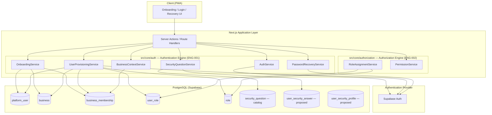

### 1.2 Core design principles

| Principle | Application |
|-----------|-------------|
| **Separation of concerns** | Supabase Auth owns credentials, sessions, and password hashing. Platform tables own business identity, tenancy, and RBAC. |
| **Mobile-first username** | Mobile number is the primary login identifier for BP-001 Phase 1. |
| **Tenant via membership** | Users never receive permissions directly; all authorization flows through `business_membership` → `user_role`. |
| **Progressive enhancement** | New auth factors (OTP, email, SSO) attach to Supabase Auth and/or `user_security_profile` without changing membership or role models. |
| **Application-layer isolation** | Tenant boundary validation on role assignment follows ADR-006 (application layer, not DB triggers). |
| **No email/SMS dependency in R1** | Password recovery uses security questions only (BP-001 scope). |

### 1.3 Identity model

| Entity | Responsibility |
|--------|----------------|
| **Supabase Auth User** | Credentials (password hash), session/JWT, `user_metadata` flags (e.g. `must_change_password`), optional future MFA/SSO linkage |
| **platform_user** | Canonical platform identity: profile, `auth_user_id` link, `phone_number`, optional `email`, `is_active` |
| **business** | Tenant root: name, type, country, status |
| **business_membership** | User ↔ Business association; `is_primary` stores last/default active business |
| **user_role** | Role assignments scoped to a membership (Platform or Business Roles) |
| **Current Business Context** | Runtime session state: active `business_id`, resolved membership, cached role/permission snapshot |

### 1.4 Proposed security extensions (design only — not in frozen schema)

The following are **architectural placeholders** for a future schema deliverable. They are referenced throughout flows but are **not implemented** in D-009:

| Proposed entity | Purpose |
|-----------------|---------|
| `security_question` | Platform-managed catalog (Favourite Colour, First School, etc.) — no custom questions |
| `user_security_answer` | Stores `security_question_id` + `answer_hash` only — question text is never stored per user; answer never plain text, never recoverable |
| `user_security_profile` | Per-user flags: `must_change_password`, `security_question_id`, lockout counters, last login |

Until those tables exist, equivalent fields may live in Supabase Auth `user_metadata` / `app_metadata` with platform services as the write boundary.

---

## 2. Authentication Responsibilities

### 2.1 Authentication Provider (Supabase Auth)

| Owns | Does not own |
|------|--------------|
| Password creation, hashing (bcrypt), verification | Business records, memberships, roles |
| Session issuance (JWT / refresh tokens) | Permission checks |
| Sign-up, sign-in, sign-out, password update API | Security question catalog content |
| Account lockout (provider-level, configurable) | Audit log persistence (delegated to Audit Engine) |
| Future: phone OTP, OAuth, SSO, passkeys | Tenant context selection logic |

**Phase 1 identifier mapping:** Mobile number is registered with Supabase Auth as the user's sign-in identifier. Implementation may use Supabase phone provider or a normalized E.164 phone stored as the auth username/email alias — the platform normalizes and validates format before provider calls.

### 2.2 Platform User

| Field / concern | Responsibility |
|-----------------|----------------|
| `id` | Stable platform UUID referenced by memberships and audit |
| `auth_user_id` | Immutable link to Supabase Auth user |
| `phone_number` | Business username; unique per platform policy |
| `email` | Optional contact; not required for BP-001 recovery |
| `first_name`, `last_name` | Profile; populated at owner registration or employee creation |
| `is_active` | Platform-level deactivation (overrides login regardless of auth state) |

### 2.3 Business

| Responsibility |
|----------------|
| Tenant container created during owner self-registration or additional-business flow |
| Holds `business_type_id`, `country_code`, `status_code`, generated `code` |
| No direct authentication state |

### 2.4 Business Membership

| Responsibility |
|----------------|
| Links `platform_user_id` to `business_id` |
| `status` references `business_membership_status` catalog (e.g. ACTIVE) |
| `is_primary` — **Remember Last Active Business**; updated when user selects or creates a business |
| One membership per `(business_id, platform_user_id)` — enforced at application layer (noted dependency in D-005) |

### 2.5 User Role

| Responsibility |
|----------------|
| Assigns `role_id` to `business_membership_id` |
| Owner onboarding assigns Platform Role `BUSINESS_OWNER` (`business_id IS NULL`, `is_system = true`) |
| Employee creation assigns configured role(s) — typically `EMPLOYEE`, `SUPERVISOR`, or tenant Business Roles |
| Assignment validation: Platform Roles → any membership; Business Roles → same-tenant only (ADR-006) |

### 2.6 Current Business Context

| Aspect | Design |
|--------|--------|
| **Storage** | Server-side session (encrypted cookie) + `business_membership.is_primary` for persistence across sessions |
| **Contents** | `platform_user_id`, `business_id`, `business_membership_id`, optional permission cache TTL |
| **Initialization** | On login: single membership → auto-select; multiple → user selection UI |
| **Cleanup** | Cleared on logout; invalidated on membership deactivation |
| **Enforcement** | Every protected Server Action / API validates context before data access (Document 09 SEC-002) |

### 2.7 Authentication Services (ENG-001)

| Service | Responsibility |
|---------|----------------|
| **AuthService** | Login, logout, session refresh, password change orchestration with Supabase Auth |
| **OnboardingService** | Owner self-registration and add-business flows; atomic provisioning |
| **UserProvisioningService** | Employee creation; links or creates `platform_user`, membership, roles |
| **BusinessContextService** | Resolve, set, switch, and clear current business; update `is_primary` |
| **PasswordRecoveryService** | Forgot-password flow via mobile + security question verification |
| **SecurityQuestionService** | Catalog read; answer hash verification; answer registration — stores question ID + hash only |
| **InvitationService** | Create, send, accept, and revoke business invitations |

**Cross-cutting:** All mutating operations emit audit events via Audit Engine (ENG-013). Authorization for employee creation and credential reset uses Authorization Engine (ENG-002) with D-007 permissions (e.g. `UserManagement.User.Create`, `Authentication.UserCredential.Execute`).

### 2.8 Authentication Status Lifecycle

Authentication and account access are governed by three independent status dimensions. Each dimension has its own lifecycle, owning service, and transition rules.

#### 2.8.1 Platform User Status

Represents the **identity-level** state of a person on the platform, independent of any single business.

| Status | Meaning | Owning service |
|--------|---------|----------------|
| **Pending** | Identity record created but onboarding not complete (e.g. invitation issued, first login not completed) | `UserProvisioningService` / `InvitationService` |
| **Active** | Identity is eligible to authenticate and access assigned businesses | `AuthService` (on successful onboarding or activation) |
| **Locked** | Temporarily blocked due to failed login/recovery attempts or security policy | `AuthService` / `PasswordRecoveryService` |
| **Disabled** | Administratively deactivated; authentication blocked regardless of credentials | `UserProvisioningService` (authorized admin action) |
| **Archived** | Permanent offboarding; identity retained for audit but not usable | `UserProvisioningService` (platform/admin action) |

**Transition triggers (Platform User)**

| From | To | Trigger | Service |
|------|-----|---------|---------|
| — | Pending | Employee created, invitation sent, or owner registration started | `UserProvisioningService`, `InvitationService`, `OnboardingService` |
| Pending | Active | First login completed, invitation accepted, or owner registration finalized | `AuthService`, `InvitationService`, `OnboardingService` |
| Active | Locked | Exceeded failed login or recovery attempts | `AuthService`, `PasswordRecoveryService` |
| Locked | Active | Lockout period expires or admin unlock | `AuthService`, `UserProvisioningService` |
| Active | Disabled | Admin deactivates user (`UserManagement.User.Deactivate`) | `UserProvisioningService` |
| Disabled | Active | Admin reactivates user (`UserManagement.User.Activate`) | `UserProvisioningService` |
| Active / Disabled | Archived | Permanent removal from active workforce (retention policy) | `UserProvisioningService` |

**Note:** Until a dedicated `platform_user.status` column exists, status may be derived from `is_active`, `user_security_profile` lockout flags, and membership state. The lifecycle above is the authoritative design target.

#### 2.8.2 Business Membership Status

Represents a user's **relationship to a specific business**. A user may hold different membership statuses across businesses simultaneously.

| Status | Meaning | Owning service |
|--------|---------|----------------|
| **Pending** | Invitation issued or membership created awaiting acceptance/first access | `InvitationService`, `UserProvisioningService` |
| **Active** | User may access the business when authenticated and authorized | `InvitationService`, `UserProvisioningService` |
| **Suspended** | Membership temporarily blocked (e.g. HR hold, compliance) — no business access | `UserProvisioningService` |
| **Ended** | Membership terminated; user no longer belongs to the business | `UserProvisioningService` |

**Transition triggers (Business Membership)**

| From | To | Trigger | Service |
|------|-----|---------|---------|
| — | Pending | Invitation created or employee added pending acceptance | `InvitationService`, `UserProvisioningService` |
| Pending | Active | User accepts invitation or completes first-login onboarding for that business | `InvitationService`, `AuthService` |
| Active | Suspended | Admin suspends membership | `UserProvisioningService` |
| Suspended | Active | Admin reinstates membership | `UserProvisioningService` |
| Active / Suspended | Ended | User removed from business or invitation expires/revoked | `UserProvisioningService`, `InvitationService` |

**Access rule:** `AuthService` and `BusinessContextService` only initialize context for memberships in **Active** status where the parent business is **Active**.

#### 2.8.3 Business Status

Represents the **tenant-level** operational state. Applies to all members of the business.

| Status | Meaning | Owning service |
|--------|---------|----------------|
| **Active** | Business is operational; members with Active membership may access | `OnboardingService` (post-activation), Business Administration services |
| **Suspended** | Business temporarily frozen — all member access blocked | Business Administration services |
| **Closed** | Business permanently closed — all memberships effectively inaccessible | Business Administration services |

**Transition triggers (Business)**

| From | To | Trigger | Service |
|------|-----|---------|---------|
| — / DRAFT | Active | Business activation completed (BP-001 onboarding lifecycle) | `OnboardingService` |
| Active | Suspended | Platform or owner-initiated suspension (billing, compliance) | Business Administration services |
| Suspended | Active | Suspension lifted | Business Administration services |
| Active / Suspended | Closed | Business permanently closed | Business Administration services |

**Note:** BP-001 onboarding may use interim status codes (e.g. `DRAFT`) before **Active**. The lifecycle above defines the long-term operational states.

#### 2.8.4 Combined access evaluation

On every login and business context switch, `AuthService` evaluates:

```
Access granted =
  Platform User = Active (not Locked, Disabled, or Archived)
  AND Business Membership = Active
  AND Business = Active
```

If any condition fails, authentication or context initialization is blocked with a business-friendly message (see §2.9.4).

### 2.9 Authentication Identifier & Validation Standards

#### 2.9.1 Username

| Rule | Detail |
|------|--------|
| Primary identifier | **Mobile Number** is the username for all BP-001 authentication flows |
| Email | Optional contact field only — **not** used as the primary login identifier in BP-001 |
| Canonical format | All mobile numbers normalized to **international E.164 format** before storage (e.g. `+254712345678`) |
| User input | Users may enter local or international formats during registration and login; the platform converts to a single canonical E.164 value |
| Uniqueness | One platform identity per canonical mobile number |

**Normalization flow:** User input → country-aware parsing (registration country or detected prefix) → E.164 validation → store in `platform_user.phone_number` and register with Supabase Auth using the canonical value.

#### 2.9.2 Mobile number validation

| Rule | Detail |
|------|--------|
| Country-aware | Validation rules are based on the **Country selected during registration** (or invitation context) |
| Rejection | Invalid mobile numbers are rejected before any auth provider or database write |
| User messaging | Clear, business-friendly validation messages (e.g. "Enter a valid mobile number for Kenya") — not raw library or provider errors |
| Configurability | Validation rules are **configurable** (country rule registry) to support future expansion to additional countries without code redesign |

**Owning service:** Input validation layer (Zod validators) + `AuthService` / `OnboardingService` / `InvitationService` before provider calls.

#### 2.9.3 Passwords

| Rule | Detail |
|------|--------|
| Character set | Passwords support **all printable characters** accepted by Supabase Auth — no unnecessary character restrictions |
| Policy enforcement | Minimum security requirements enforced by platform validator **and** authentication provider (see §2.10) |
| Storage | Passwords hashed by Supabase Auth only — never stored in platform tables |

#### 2.9.4 User experience — authentication errors

| Rule | Detail |
|------|--------|
| Business-friendly messages | All authentication errors presented to end users shall be understandable and actionable |
| No raw provider errors | Supabase Auth and internal error codes are mapped to user-friendly messages in `AuthService` |
| Security-safe messaging | Login failure messages do not reveal whether the mobile number exists (where policy requires ambiguity) |
| Examples | "Incorrect mobile number or password", "Your account is temporarily locked. Try again in 15 minutes.", "This business is currently unavailable." |

### 2.10 Password Policy (BP-001)

Minimum password requirements for BP-001. Enforced at registration, employee creation, first-login password change, and password recovery.

| Requirement | BP-001 minimum |
|-------------|----------------|
| Minimum length | **8 characters** |
| Uppercase | At least **1 uppercase** letter (A–Z) |
| Lowercase | At least **1 lowercase** letter (a–z) |
| Number | At least **1 numeric** digit (0–9) |
| Special character | At least **1 special character** from the printable set supported by the authentication provider (e.g. `!@#$%^&*()_+-=[]{}|;:'",.<>?/\`) |

**Design decisions:**

| Decision | Detail |
|----------|--------|
| Character freedom | Users may use any printable characters beyond the minimum requirements — no unnecessary exclusions |
| Dual enforcement | Platform validator (Zod) validates before provider call; Supabase Auth enforces provider-level rules |
| Initial passwords | Employee initial passwords set by admin must meet the same minimum policy |
| Confirm password | All password-set flows require confirmation match before submission |

**Future releases (design only — not in BP-001 scope):**

| Future capability | Description |
|-------------------|-------------|
| Password history | Prevent reuse of recent passwords (N-generation history) |
| Password expiry | Configurable maximum password age per business or role |
| Configurable password policies | Business Owner or platform admin adjusts minimum length and complexity via Security Profile configuration |

These future capabilities extend `user_security_profile` and Security Profile configuration without redesigning the authentication architecture.

### 2.11 Authentication Audit Events

The following authentication and onboarding events **shall automatically produce Audit Log entries** via the Audit Engine (ENG-013). This section documents **events produced** only — it does not design the Audit Engine.

| Event | Emitted when | Emitting service |
|-------|--------------|------------------|
| **User Registration** | Business Owner completes self-registration | `OnboardingService` |
| **Login Success** | User authenticates successfully | `AuthService` |
| **Login Failure** | Authentication attempt fails (invalid credentials, inactive account, etc.) | `AuthService` |
| **Logout** | User explicitly signs out | `AuthService` |
| **Password Changed** | User changes password (first login or voluntary change) | `AuthService` |
| **Password Reset** | User completes forgot-password flow via security question | `PasswordRecoveryService` |
| **Business Switch** | User switches Current Business Context to a different business | `BusinessContextService` |
| **Account Locked** | Platform user enters Locked status (failed attempts threshold) | `AuthService`, `PasswordRecoveryService` |
| **Invitation Accepted** | Invited user accepts business invitation and membership becomes Active | `InvitationService` |

**Minimum audit payload (per event):** actor `platform_user_id` (if known), timestamp, event type, outcome, client context (device/IP where available), affected `business_id` (if applicable).

**Additional events (recommended, not minimum):** Employee created, invitation sent, invitation revoked, membership suspended, admin password reset.

---

## 3. Flow Designs

### 3.1 Business Owner Self Registration

#### 3.1.1 Capture

**Business information**

| Field | Required |
|-------|----------|
| Business Name | Yes |
| Business Type | Yes |
| Country | Yes |
| Mobile Number (business contact) | Yes |
| Email | No |

**Owner account**

| Field | Required |
|-------|----------|
| Mobile Number (username) | Yes — same as or validated against business mobile |
| Password | Yes |
| Confirm Password | Yes |
| Security Question (from catalog) | Yes |
| Security Answer | Yes — hashed before storage |

**Security rules**

- Passwords: hashed by Supabase Auth only — never stored in platform tables
- Security answers: hashed by platform (`SecurityQuestionService`) — never plain text, never displayed, never recoverable

#### 3.1.2 Sequence diagram

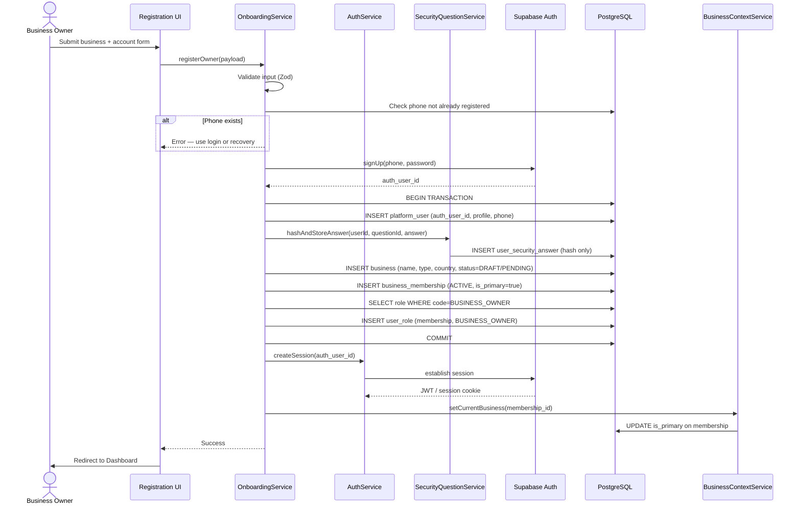

#### 3.1.3 Data flow

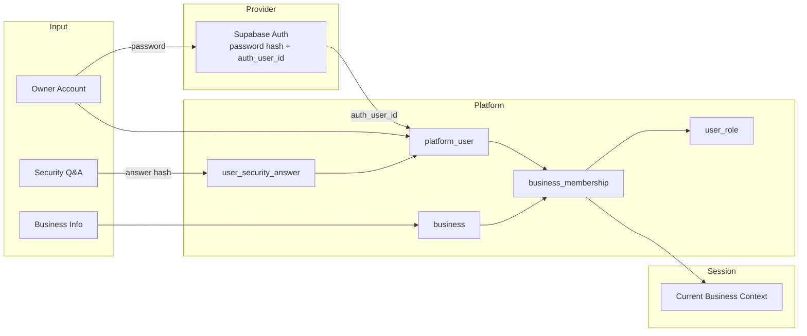

#### 3.1.4 Tables affected

| Table | Operation | Notes |
|-------|-----------|-------|
| Supabase Auth | CREATE | User + hashed password |
| `platform_user` | INSERT | Linked via `auth_user_id` |
| `business` | INSERT | Initial status per onboarding policy |
| `business_membership` | INSERT | `is_primary = true` |
| `role` | READ | Resolve `BUSINESS_OWNER` seed row |
| `user_role` | INSERT | Assign owner platform role |
| `user_security_answer` | INSERT | Hashed answer only (proposed) |
| `security_question` | READ | Validate catalog selection |
| Session store | WRITE | Auth session + business context |

#### 3.1.5 Services involved

`OnboardingService` (orchestrator) → `AuthService`, `SecurityQuestionService`, `BusinessContextService`, `RoleAssignmentService`, Audit Engine

---

### 3.2 Existing User Creates Another Business

**Scenario:** Vincent owns ABC Ltd and creates XYZ Ltd.

#### 3.2.1 Preconditions

- Vincent has valid authenticated session
- Current business context may be ABC Ltd

#### 3.2.2 Sequence diagram

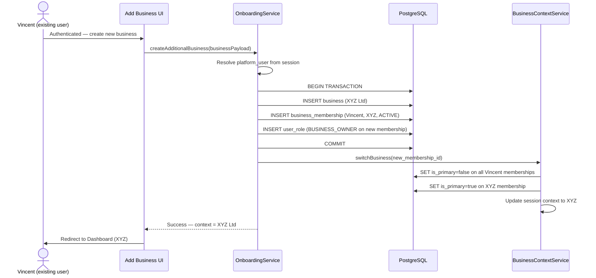

#### 3.2.3 Design decisions

| Decision | Rationale |
|----------|-----------|
| Reuse existing `platform_user` | One identity across all businesses |
| New `business` + `business_membership` per tenant | Preserves multi-tenant isolation |
| Assign `BUSINESS_OWNER` on new membership | Same platform role record (D-007) — not duplicated per tenant |
| Switch context immediately | User expects to work in the business they just created |
| No new Supabase Auth user | Credentials are identity-level, not tenant-level |

#### 3.2.4 Tables affected

| Table | Operation |
|-------|-----------|
| `business` | INSERT |
| `business_membership` | INSERT |
| `user_role` | INSERT |
| `business_membership` | UPDATE (`is_primary` flags) |
| Session / context | UPDATE |

---

### 3.3 Employee Creation

**Rule:** Employees SHALL NOT self-register. Created only by authorized users (`UserManagement.User.Create` or equivalent).

#### 3.3.1 Capture

| Field | Required |
|-------|----------|
| First Name | Yes |
| Last Name | Yes |
| Mobile Number (username) | Yes |
| Email | No |
| Job Title | Yes |
| Assigned Role(s) | Yes — Platform and/or Business Roles |
| Initial Password | Set by Owner/Admin |

#### 3.3.2 Sequence diagram

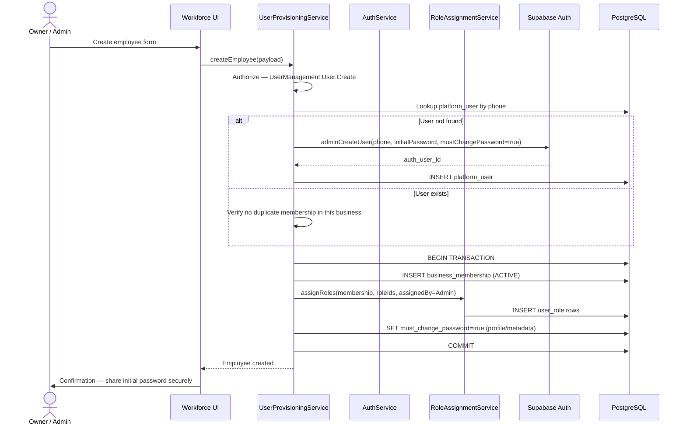

#### 3.3.3 Account state

| Flag | Value at creation | Purpose |
|------|-------------------|---------|
| `must_change_password` | `true` | Forces first-login password change flow |
| Security question | Not set | Completed at first login |
| `is_active` | `true` | Unless business policy requires activation step |

#### 3.3.4 Tables affected

| Table | Operation |
|-------|-----------|
| Supabase Auth | CREATE (if new user) or password reset (if existing user joining new business) |
| `platform_user` | INSERT or READ |
| `business_membership` | INSERT |
| `user_role` | INSERT (one or more) |
| `user_security_profile` | INSERT/UPDATE — `must_change_password=true` (proposed) |

---

### 3.4 Employee First Login

#### 3.4.1 Sequence diagram

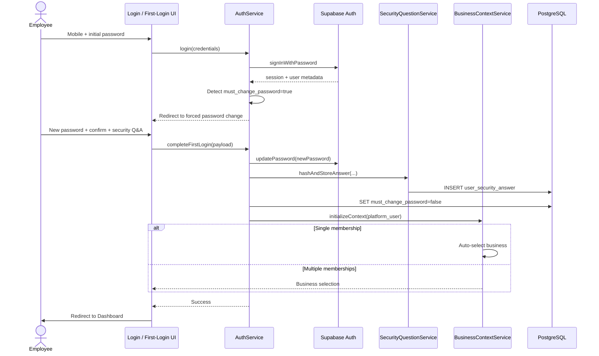

#### 3.4.2 Rules

- Initial password cannot be reused as new password (policy enforced by `AuthService`)
- Security answer hashed before storage — same rules as owner registration
- Until first-login completion, employee may access **only** the first-login/password-change routes (middleware guard)

---

### 3.5 Login

#### 3.5.1 Sequence diagram

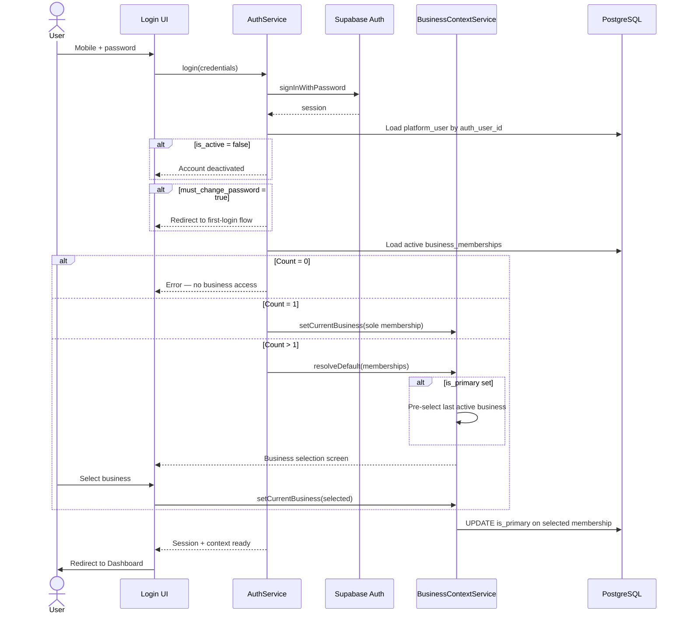

#### 3.5.2 Remember Last Active Business

| Mechanism | Behavior |
|-----------|----------|
| `business_membership.is_primary` | Persisted default; exactly one `true` per user (application enforced) |
| Session context | Holds active `business_id` for current session |
| On login | Pre-select primary membership; user may switch |
| On explicit switch | Update `is_primary` + session context |

---

### 3.6 Logout

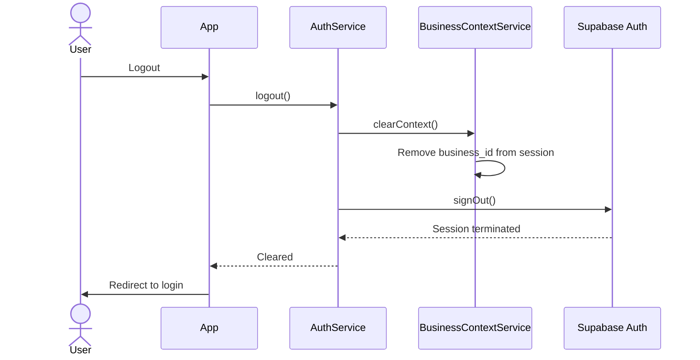

| Concern | Action |
|---------|--------|
| Session termination | Supabase Auth `signOut()` — invalidates JWT |
| Business context cleanup | `BusinessContextService.clearContext()` — remove tenant from server session |
| Client state | Clear any cached permission / business data in client stores |
| `is_primary` | **Not** cleared — persists for next login |

---

### 3.7 Password Recovery (BP-001)

**Constraints:** No email dependency. No SMS dependency.

#### 3.7.1 Flow

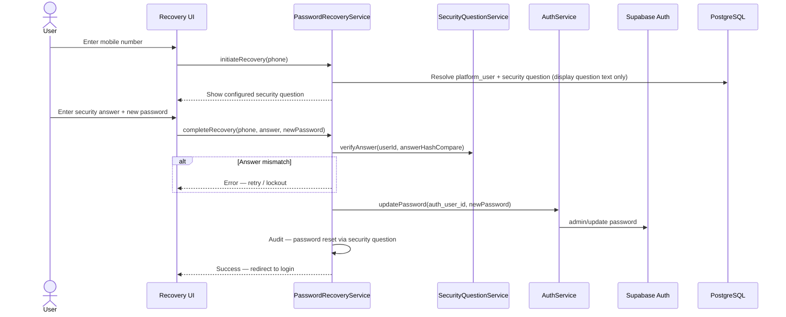

#### 3.7.2 Security controls

| Control | Implementation |
|---------|----------------|
| Rate limiting | Per mobile number + IP on recovery endpoints |
| Lockout | Increment failed answer attempts; temporary lock per security profile policy |
| Answer verification | Constant-time compare of hashed answer |
| No answer recovery | Wrong answer = failed verification only; support cannot retrieve answer |
| Password policy | Enforced by Supabase Auth + platform validator |

Future phases (email reset, SMS OTP) will be **separate flows** documented in Progressive Authentication — they do not replace this flow in R1.

---

### 3.8 Security Questions

#### 3.8.1 Catalog model

| Rule | Detail |
|------|--------|
| Source | Platform-managed **Security Question Catalog** (`security_question` reference table) — seeded, configurable by platform administrators |
| User custom questions | **Not permitted** — users select from the catalog only |
| Selection | User picks one question from active catalog entries during registration or first login |
| Examples | Favourite Colour, First School, Mother's First Name, Favourite Food |

#### 3.8.2 Storage model (per user)

The platform stores **only** the following against each user — never the question text, never the plain-text answer:

| Stored field | Location | Purpose |
|--------------|----------|---------|
| `security_question_id` | `user_security_answer` (proposed) | FK to catalog — resolves question text at display time |
| `answer_hash` | `user_security_answer` (proposed) | Hashed answer only (bcrypt or Argon2id) |

**Explicit design rules:**

| Rule | Detail |
|------|--------|
| Question text not stored per user | Question text lives **only** in the Security Question Catalog; retrieved by ID when needed (recovery, verification) |
| Answers never plain text | Security answers are hashed **before** storage — never written to database, logs, or metadata in clear text |
| Answers never retrievable | Hashes are one-way; support and administrators cannot recover or display the original answer |
| Answers never displayed | UI may show the catalog question text; the answer field is write-only |
| Verification | Compare submitted answer (normalized) against stored hash using constant-time comparison |

**Display during password recovery:** System loads `security_question_id` from `user_security_answer`, joins to catalog for question text, presents text to user, verifies submitted answer against `answer_hash`.

#### 3.8.3 Lifecycle

| Event | Action |
|-------|--------|
| Owner registration | Select question + provide answer (hashed) |
| Employee first login | Select question + provide answer (hashed) |
| Password recovery | Present user's configured question; verify answer hash |
| Question change (future) | Re-authenticate + set new answer; audit logged |

---

### 3.9 Business Invitation Flow

Business invitations allow an authorized user to invite a person to join a business with a pre-assigned role. Invitations support workforce onboarding without open self-registration. Employees may also be provisioned directly (§3.3); invitations are the **acceptance-gated** alternative.

**Rule:** Invited users do not gain business access until the invitation is **accepted** and membership status transitions from **Pending** to **Active** (see §2.8.2).

#### 3.9.1 Capture (invitation creation)

| Field | Required |
|-------|----------|
| Mobile Number | Yes — invitee identifier |
| First Name | Yes |
| Last Name | Yes |
| Email | No |
| Job Title | Yes |
| Assigned Role(s) | Yes |
| Initial Password (Scenario A only) | Set by inviter when invitee does not exist |

#### 3.9.2 Sequence diagram

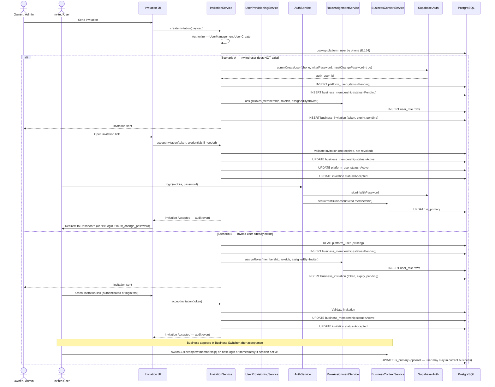

#### 3.9.3 Scenario summary

| Aspect | Scenario A — User does NOT exist | Scenario B — User already exists |
|--------|----------------------------------|----------------------------------|
| `platform_user` | CREATE (Pending → Active on acceptance) | REUSE existing |
| Supabase Auth | CREATE with initial password | No new auth user |
| `business_membership` | CREATE (Pending → Active on acceptance) | CREATE only (Pending → Active on acceptance) |
| `user_role` | ASSIGN on invitation | ASSIGN on invitation |
| Acceptance action | Accept invitation + login + initialize context | Accept invitation only |
| Post-acceptance | Initialize Current Business Context | Business visible in Business Switcher |
| First login | May require password change + security question (§3.4) | Standard login; switch to new business |

#### 3.9.4 Tables affected

| Table | Scenario A | Scenario B |
|-------|:----------:|:----------:|
| Supabase Auth | CREATE | — |
| `platform_user` | CREATE, UPDATE (status) | READ |
| `business_membership` | CREATE, UPDATE (status) | CREATE, UPDATE (status) |
| `user_role` | CREATE | CREATE |
| `role` | READ | READ |
| `business_invitation` | CREATE, UPDATE | CREATE, UPDATE |
| Session / context | WRITE (on acceptance + login) | UPDATE (on switch, optional) |

**Note:** `business_invitation` is a proposed entity for a future schema deliverable (invitation token, expiry, status, inviter, membership reference).

#### 3.9.5 Services involved

| Service | Responsibility |
|---------|----------------|
| **InvitationService** | Create, send, validate, accept, and revoke invitations; orchestrate acceptance flows |
| **UserProvisioningService** | Create `platform_user` when invitee does not exist |
| **AuthService** | Login after acceptance (Scenario A); session establishment |
| **RoleAssignmentService** | Assign roles at invitation creation with ADR-006 tenant validation |
| **BusinessContextService** | Initialize context (Scenario A) or expose new business in switcher (Scenario B) |
| **Audit Engine** | `Invitation Accepted` event (§2.11) |

---

## 4. Service Responsibilities (Summary)

| Service | Primary operations | Depends on |
|---------|-------------------|------------|
| **AuthService** | Login, logout, session refresh, password update | Supabase Auth, `platform_user` |
| **OnboardingService** | Owner registration, add business | AuthService, BusinessContextService, RoleAssignmentService |
| **UserProvisioningService** | Create employee, link existing user | AuthService, RoleAssignmentService |
| **BusinessContextService** | Get/set/switch/clear current business | `business_membership` |
| **PasswordRecoveryService** | Forgot password via security Q&A | SecurityQuestionService, AuthService |
| **SecurityQuestionService** | Catalog read, hash, verify answers | `security_question`, `user_security_answer` |
| **InvitationService** | Create, send, accept, revoke business invitations | `business_invitation`, `business_membership`, `user_role` |
| **RoleAssignmentService** | Assign/revoke roles with tenant validation | `user_role`, `role` (ADR-006) |
| **PermissionService** | Resolve effective permissions for context | `user_role`, `role_permission`, `permission` |

---

## 5. Table Interaction Map

### 5.1 By flow

| Flow | Supabase Auth | platform_user | business | business_membership | user_role | role | security_question | user_security_answer | user_security_profile |
|------|:-------------:|:-------------:|:--------:|:-------------------:|:---------:|:----:|:-----------------:|:--------------------:|:---------------------:|
| Owner self-registration | C | C | C | C | C | R | R | C | C |
| Add business | — | R | C | C | C | R | — | — | — |
| Employee creation | C | C/R | R | C | C | R | — | — | C/U |
| Employee first login | U | R | — | R | — | — | R | C | U |
| Login | R | R | R | R | R | R | — | — | R |
| Logout | D(session) | — | — | — | — | — | — | — | — |
| Password recovery | U | R | — | — | — | — | R | R | R |
| Invitation (new user) | C | C | R | C/U | C | R | — | — | C/U |
| Invitation (existing user) | — | R | R | C/U | C | R | — | — | — |
| Invitation accepted | R/U | U | R | U | R | — | — | — | — |

**Legend:** C = Create, R = Read, U = Update, D = Delete/invalidate

### 5.2 Reference data (read-only in auth flows)

| Table | Usage |
|-------|-------|
| `business_type` | Owner registration — validate business type |
| `country` | Owner registration — validate country |
| `business_membership_status` | Membership status codes |
| `role` | Resolve platform roles by `code` (`BUSINESS_OWNER`, `EMPLOYEE`, etc.) |

---

## 6. Progressive Authentication Roadmap

The architecture separates **Identity Provider capabilities** from **Platform IAM**. Each phase extends the provider and profile layer; `platform_user`, `business_membership`, and `user_role` remain **unchanged**. No phase requires redesign of the onboarding, membership, or RBAC models.

```mermaid
flowchart LR
    subgraph P1["Phase 1 — BP-001 (R1)"]
        A1[Mobile Number]
        A2[Password]
        A3[Security Question]
    end

    subgraph P2["Phase 2"]
        B1[SMS OTP]
    end

    subgraph P3["Phase 3"]
        C1[Email Verification]
        C2[Email Password Reset]
    end

    subgraph P4["Phase 4"]
        D1[Authenticator App]
        D2[MFA]
    end

    subgraph P5["Phase 5"]
        E1[Google Login]
        E2[Microsoft Login]
        E3[Enterprise SSO]
        E4[Passkeys]
        E5[Biometrics]
    end

    P1 --> P2 --> P3 --> P4 --> P5
```

| Phase | Capability | Integration point | Platform impact |
|-------|------------|-------------------|-----------------|
| **1** | Mobile Number + Password + Security Question | Supabase Auth password; E.164 mobile as username; platform `user_security_answer` (question ID + hash) | **Current design — BP-001** |
| **2** | SMS OTP | Supabase Auth phone provider or ENG-009 Notification Engine for OTP delivery | Add `preferred_auth_method` to `user_security_profile`; optional OTP login or step-up in `AuthService` |
| **3** | Email Verification + Email Password Reset | Supabase Auth email templates + verification flags | Optional `platform_user.email`; additional recovery path in `PasswordRecoveryService` — security-question recovery remains available |
| **4** | Authenticator App + MFA | TOTP/WebAuthn via Supabase Auth MFA or provider extension | MFA enrollment flags on `user_security_profile`; step-up auth in `AuthService` — membership/RBAC unchanged |
| **5** | Google / Microsoft Login, Enterprise SSO, Passkeys, Biometrics | Supabase Auth OAuth/OIDC providers; WebAuthn; device biometrics via platform APIs | Link external identities to existing `auth_user_id`; business context and role assignment flows unchanged |

**Evolution principle:** Each phase adds **authentication factors and recovery methods** at the provider/profile layer. The platform continues to:

1. Resolve identity via `platform_user.auth_user_id`
2. Evaluate status lifecycle (§2.8)
3. Initialize Current Business Context via `business_membership`
4. Authorize via `user_role` → permissions

**Key invariant:** Authorization always resolves through `business_membership` → `user_role` → permissions, regardless of how the user authenticated or which phase is active.

---

## 7. External IAM Readiness

The platform can integrate with **Azure AD**, **Keycloak**, or **Auth0** without redesign by treating them as interchangeable **Authentication Providers** behind the same `AuthService` abstraction.

### 7.1 Integration pattern

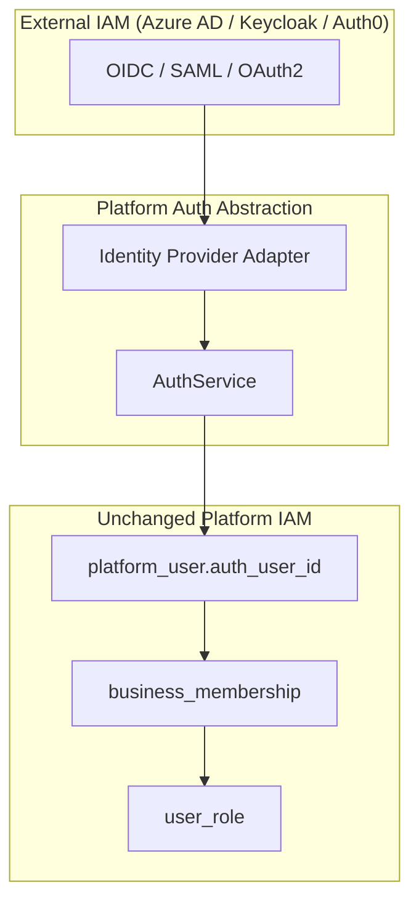

### 7.2 Mapping strategy

| External IAM | Provider role | Platform mapping |
|--------------|---------------|------------------|
| **Azure AD** | Corporate SSO (Phase 5) | OIDC tokens → Supabase Auth federation or direct JWT validation → `auth_user_id` |
| **Keycloak** | Self-hosted IAM | Keycloak as Supabase external provider or custom adapter implementing `IdentityProviderAdapter` |
| **Auth0** | Managed IAM | Auth0 Actions sync user → `platform_user`; roles remain platform-managed (Auth0 roles not authoritative for business permissions) |

### 7.3 Design rules for external IAM

| Rule | Rationale |
|------|-----------|
| **Platform RBAC is authoritative** | External groups/roles map to login only — business permissions always from `user_role` |
| **`auth_user_id` remains the join key** | Whether UUID from Supabase or mapped external subject ID stored in provider |
| **Business context unchanged** | SSO login still requires business selection for multi-tenant users |
| **Security questions optional for SSO users** | Recovery via IdP; platform security Q&A becomes fallback for local accounts |
| **Adapter pattern** | `IdentityProviderAdapter` interface: `signIn`, `signOut`, `refreshSession`, `updatePassword`, `adminCreateUser` |

### 7.4 Supabase as integration hub (recommended path)

Supabase Auth supports external OAuth/OIDC providers. Enterprise SSO attaches at the Supabase project level; the platform continues to:

1. Receive authenticated session from Supabase
2. Resolve `platform_user` by `auth_user_id`
3. Initialize business context and authorization as today

This avoids duplicating OIDC client logic in the Next.js app and preserves Progressive Authentication phases.

---

## 8. Risks and Mitigation

| Risk | Severity | Mitigation |
|------|----------|------------|
| Mobile number as sole recovery factor | Medium | Security question + rate limiting + lockout; Phase 2 adds SMS OTP |
| Security question answer guessability | Medium | Normalize answers (lowercase, trim); minimum length; lockout after N failures |
| Schema gaps (`must_change_password`, security tables) | High | Document as proposed extensions; interim use Supabase `user_metadata` with strict service-layer writes |
| `platform_user.email` NOT NULL vs optional email requirement | Medium | Future schema correction deliverable; use placeholder or phone-derived alias for R1 |
| Duplicate memberships per business | Medium | Application-layer unique check on `(business_id, platform_user_id)` before insert |
| Cross-tenant role assignment | Critical | ADR-006 validation in `RoleAssignmentService` on every assignment |
| Session fixation / hijacking | Medium | Supabase secure cookies, HTTPS only, short JWT expiry, refresh rotation |
| Employee initial password exposure | Medium | Force change on first login; optional temporary password expiry |
| Multi-business context leakage | Critical | Middleware validates business context on every request; never trust client-supplied `business_id` alone |
| Supabase vendor lock-in | Low | `IdentityProviderAdapter` abstraction enables provider swap |

---

## 9. Design Decisions and Assumptions

### 9.1 Architecture Decision Records (this deliverable)

**ADR namespace:** ADR-009 through ADR-020 are **BP-001 Authentication & Onboarding** decisions recorded by deliverable D-009. They are distinct from Enterprise Technology ADRs (Document 01: ADR-001–007) and IAM Permission Catalog ADRs (D-007: ADR-008, ADR-010 Permission Constants).

#### Summary table

| ID | Decision | Status |
|----|----------|--------|
| ADR-009 | Supabase Auth is the Phase 1 Authentication Provider; platform tables do not store password hashes | Approved |
| ADR-010 | Mobile number is the primary username for BP-001 authentication flows | Approved |
| ADR-011 | Security answers stored as platform-managed hashes — never in Supabase Auth metadata as plain text | Approved |
| ADR-012 | Current Business Context is session-scoped with `business_membership.is_primary` persistence | Approved |
| ADR-013 | Password recovery in R1 uses security questions only — no email/SMS | Approved |
| ADR-014 | Progressive Authentication extends provider capabilities without redesigning membership/RBAC | Approved |
| ADR-015 | External IAM integrates via provider adapter; platform RBAC remains authoritative | Approved |
| ADR-016 | Mobile numbers stored in canonical E.164 format; country-aware validation at registration | Approved |
| ADR-017 | BP-001 minimum password policy: 8 chars, uppercase, lowercase, number, special character | Approved |
| ADR-018 | Authentication audit events (§2.11) are mandatory platform outputs to Audit Engine | Approved |
| ADR-019 | Business invitations use Pending → Active membership lifecycle; acceptance required before access | Approved |
| ADR-020 | Security question text stored in catalog only; per-user storage is question ID + answer hash | Approved |

#### ADR-009 — Supabase Auth as Phase 1 Authentication Provider

**Status:** Approved

**Context:** BP-001 requires password-based authentication with progressive enhancement. Credentials must not be stored in platform tables.

**Decision:** Supabase Auth is the Phase 1 Authentication Provider. Password hashing, session/JWT management, sign-up, sign-in, sign-out, and password update are delegated to Supabase Auth. Platform tables store identity and tenancy only.

**Rationale:** Aligns with approved technology stack (Document 01, Document 07). Separates credential security from business IAM.

**Consequences:** `platform_user.auth_user_id` is the immutable join key. Provider swap requires `IdentityProviderAdapter` (ADR-015).

---

#### ADR-010 — Mobile Number as Primary Username (BP-001)

**Status:** Approved

**Context:** BP-001 targets mobile-first SMEs. Email is optional and not universally available.

**Decision:** Mobile number is the primary login identifier for all BP-001 authentication flows. Email remains optional contact data and is not used as the primary login identifier in BP-001.

**Rationale:** Mobile-first onboarding; aligns with BP-001 business registration capture fields.

**Consequences:** Supabase Auth registration uses normalized E.164 mobile (ADR-016). Document 09 §4.2–4.3 role-based auth defaults may be superseded for BP-001 Phase 1 by this deliverable (see Cross-Document Consistency Review, §13.3).

---

#### ADR-011 — Security Answer Hashing

**Status:** Approved

**Context:** Password recovery requires security questions without email/SMS in R1.

**Decision:** Security answers are hashed by the platform (`SecurityQuestionService`) before storage. Plain-text answers are never stored in platform tables, Supabase Auth metadata, or logs.

**Rationale:** One-way hashing prevents answer recovery even if database is compromised.

**Consequences:** Verification uses constant-time hash comparison only. Support cannot retrieve answers.

---

#### ADR-012 — Current Business Context

**Status:** Approved

**Context:** Users may belong to multiple businesses. Every protected operation requires tenant context (Document 09 SEC-002).

**Decision:** Current Business Context is session-scoped (encrypted server session). `business_membership.is_primary` persists the last active business across sessions.

**Rationale:** Supports multi-business users without duplicating identity. Remembers last active business per BP-001 requirement.

**Consequences:** `BusinessContextService` owns context initialization, switch, and cleanup. Cleared on logout; `is_primary` persists.

---

#### ADR-013 — R1 Password Recovery via Security Questions

**Status:** Approved

**Context:** BP-001 explicitly excludes email and SMS dependencies for password recovery.

**Decision:** Phase 1 forgot-password flow uses mobile number + security question verification + new password only.

**Rationale:** SME-friendly recovery without external messaging infrastructure in R1.

**Consequences:** Phase 3 may add email reset as an additional path (§6). Security-question recovery remains available.

---

#### ADR-014 — Progressive Authentication

**Status:** Approved

**Context:** Platform must evolve authentication without redesigning IAM on each phase.

**Decision:** Authentication phases (1–5) extend Supabase Auth and `user_security_profile` capabilities. `platform_user`, `business_membership`, and `user_role` models remain stable across all phases.

**Rationale:** Progressive enhancement preserves investment in onboarding, membership, and RBAC architecture.

**Consequences:** New factors attach at provider/profile layer. Authorization invariant unchanged (§6).

---

#### ADR-015 — External IAM Integration

**Status:** Approved

**Context:** Enterprise customers may require Azure AD, Keycloak, or Auth0.

**Decision:** External IAM providers integrate via `IdentityProviderAdapter` behind `AuthService`. Platform RBAC (`user_role` → permissions) remains authoritative. External provider roles/groups are not authoritative for business permissions.

**Rationale:** Enables enterprise SSO without redesigning tenant or role models.

**Consequences:** `auth_user_id` remains join key. Supabase Auth federation is the recommended integration hub (§7.4).

---

#### ADR-016 — E.164 Mobile Normalization

**Status:** Approved

**Context:** Users may enter local or international mobile formats.

**Decision:** All mobile numbers are normalized to international E.164 format before storage and Supabase Auth registration. Validation is country-aware based on selected country during registration.

**Rationale:** Single canonical identifier prevents duplicates and enables consistent login.

**Consequences:** Validation rules are configurable per country for future expansion. Invalid numbers rejected with business-friendly messages (§2.9.4).

---

#### ADR-017 — BP-001 Minimum Password Policy

**Status:** Approved

**Context:** BP-001 requires enforceable password standards without unnecessary character restrictions.

**Decision:** Minimum password policy for BP-001: 8 characters, at least 1 uppercase, 1 lowercase, 1 numeric digit, 1 special character. Passwords support all printable characters accepted by Supabase Auth.

**Rationale:** Balances SME usability with baseline security. Dual enforcement by platform validator and provider.

**Consequences:** Future releases may add password history, expiry, and configurable policies via Security Profile (§2.10).

---

#### ADR-018 — Mandatory Authentication Audit Events

**Status:** Approved

**Context:** BP-001 and Document 09 require audit logging of authentication events.

**Decision:** Nine authentication events (§2.11) shall automatically produce Audit Log entries via Audit Engine (ENG-013).

**Rationale:** Compliance, security monitoring, and operational troubleshooting.

**Consequences:** Emitting services must invoke Audit Engine on each event. Audit Engine design is a separate deliverable.

---

#### ADR-019 — Business Invitation Lifecycle

**Status:** Approved

**Context:** Workforce onboarding requires invitation-gated access without open employee self-registration.

**Decision:** Business invitations create membership in **Pending** status. Access is granted only after invitation acceptance transitions membership to **Active**.

**Rationale:** Prevents unauthorized business access. Supports both new and existing platform users (§3.9).

**Consequences:** `InvitationService` orchestrates create/accept flows. `Invitation Accepted` audit event required (ADR-018).

---

#### ADR-020 — Security Question Storage Model

**Status:** Approved

**Context:** Security questions support password recovery. Question text must remain centrally managed.

**Decision:** Users select from configurable Security Question Catalog. Per-user storage contains only `security_question_id` and `answer_hash`. Question text is never stored against the user.

**Rationale:** Catalog updates propagate without per-user migration. Minimizes PII storage.

**Consequences:** Recovery UI resolves question text from catalog by ID. Answers are never displayed, exported, or recoverable.

---

#### Related ADR references (prior deliverables)

| ID | Decision | Source deliverable | Used in D-009 |
|----|----------|-------------------|---------------|
| ADR-003 | PostgreSQL (Supabase) as Database | Document 01 — Enterprise Solution Architecture | Technology stack baseline for Supabase Auth |
| ADR-005 | Hybrid Role Model | D-004 — Role Schema | Platform vs Business roles; `BUSINESS_OWNER` assignment |
| ADR-006 | Tenant Isolation Enforcement (application layer) | D-005/D-006 — IAM Schema | Role assignment validation; no DB triggers |
| ADR-008 | Platform Permission Catalog | D-007 — IAM Seed Design | Permission codes for auth/onboarding authorization checks |

### 9.2 Assumptions

| # | Assumption |
|---|------------|
| A1 | Platform Role code for business owner is `BUSINESS_OWNER` per D-007 seed design (prompt alias "OWNER" maps to this seed) |
| A2 | Owner and business contact mobile numbers may be the same field captured once in UI |
| A3 | Business `code` is system-generated during onboarding (not user-entered) |
| A4 | Initial business `status_code` follows BP-001 onboarding lifecycle (e.g. DRAFT until activation) |
| A5 | `user_security_answer`, `user_security_profile`, and `security_question` tables will be defined in a subsequent schema deliverable |
| A6 | Employee `must_change_password` may live in Supabase `user_metadata` until platform profile table exists |
| A7 | Authorized employee creators hold `UserManagement.User.Create` (or `BUSINESS_OWNER` effective permission) |
| A8 | Authentication audit events per §2.11 are mandatory outputs; Audit Engine design is separate |
| A9 | PIN authentication for operational staff (Document 09 §4.3) is a **separate Phase 1b** track within ENG-001 — not part of this BP-001 password-first deliverable but shares `SecurityQuestionService` |
| A10 | `business_invitation` entity will be defined in a future schema deliverable alongside invitation token and expiry fields |
| A11 | Platform User, Business Membership, and Business status lifecycles (§2.8) may use derived state until dedicated status columns are added |

### 9.3 Known schema alignment notes (documentation only)

The frozen IAM schema does not yet include security-question or `must_change_password` columns. This architecture **does not modify** the approved schema. Implementation deliverables will:

1. Add security profile entities aligned to this design
2. Resolve `platform_user.email` optional requirement vs current NOT NULL constraint
3. Add unique constraint on `(business_id, platform_user_id)` for `business_membership`

---

## 10. Approval Checklist

| # | Deliverable | Section | Status |
|---|-------------|---------|--------|
| 1 | Architecture Overview | §1 | ✅ Approved |
| 2 | Sequence Diagrams | §3.1–3.9 | ✅ Approved |
| 3 | Data Flow Diagrams | §3.1.3 | ✅ Approved |
| 4 | Service Responsibilities | §2.7, §4 | ✅ Approved |
| 5 | Table Interaction Map | §5 | ✅ Approved |
| 6 | Progressive Authentication Roadmap | §6 | ✅ Approved |
| 7 | Risks and Mitigation | §8 | ✅ Approved |
| 8 | Design Decisions and Assumptions | §9 | ✅ Approved |
| 9 | Authentication Status Lifecycle | §2.8 | ✅ Approved |
| 10 | Password Policy (BP-001) | §2.10 | ✅ Approved |
| 11 | Authentication Audit Events | §2.11 | ✅ Approved |
| 12 | Identifier & Validation Standards | §2.9 | ✅ Approved |
| 13 | Business Invitation Flow | §3.9 | ✅ Approved |
| 14 | Security Question Storage Model | §3.8.2 | ✅ Approved |

**Deliverable state:** Closed — Architecture Locked — Ready for Development (see §13).

---

## 11. D-009 Review Refinement — Summary of Changes

The following refinements were applied per review feedback, reviewed, and **approved**. All previously approved content was preserved.

| # | Refinement | Change applied |
|---|------------|----------------|
| 1 | **Business Invitation Flow** | Added §3.9 with Scenario A (new user) and Scenario B (existing user), sequence diagram, tables affected, and services involved |
| 2 | **Authentication Status Lifecycle** | Added §2.8 defining Platform User, Business Membership, and Business status states, owning services, and transition triggers |
| 3 | **Password Policy** | Added §2.10 with BP-001 minimum requirements (8 chars, uppercase, lowercase, number, special character) and future policy notes |
| 4 | **Authentication Audit Events** | Added §2.11 documenting nine mandatory audit events and emitting services — no Audit Engine design |
| 5 | **Security Question Storage** | Expanded §3.8.2 — catalog-only question text; per-user storage is `security_question_id` + `answer_hash` only |
| 6 | **Progressive Authentication Roadmap** | Expanded §6 to five phases (added Phase 4 MFA; moved SSO/social/passkeys/biometrics to Phase 5) with no-redesign emphasis |
| 7 | **Identifier & Validation Standards** | Added §2.9 — E.164 mobile normalization, country-aware validation, password character rules, business-friendly error messaging |

**Additional updates:** `InvitationService` added to §2.7 and §4; invitation rows added to §5.1 table map; ADR-016–020 and assumptions A10–A11 added; External IAM Phase reference updated to Phase 5.

---

## 12. Documentation Pack — Deliverable D-009

### 12.1 Delivery Summary

| Attribute | Value |
|-----------|-------|
| Release | R1 – Platform Foundation |
| Build Pack | BP-001 – Business Setup & Onboarding |
| Capability | Authentication & Business Onboarding |
| Deliverable ID | D-009 |
| Deliverable | Authentication & Business Onboarding Architecture |
| Status | ✅ Approved |
| Architecture State | 🔒 Architecture Locked |
| Implementation Status | Ready for Development |
| Approved | 2026-07-22 |

### 12.2 Outcome

The complete Authentication and Business Onboarding architecture is approved and locked. Covers owner self-registration, add-business, employee provisioning, first login, login/logout, password recovery, business invitations, status lifecycles, password policy, audit events, security question storage, identifier validation (E.164), Progressive Authentication (Phases 1–5), and external IAM readiness.

**Architecture is locked.** No redesign unless explicitly instructed. Implementation code, schema extensions, migrations, and APIs are deferred to subsequent deliverables.

### 12.3 Architecture Decision Records

Full ADR records with Context, Decision, Rationale, and Consequences: **§9.1** (ADR-009 through ADR-020). Related prior ADRs: ADR-003, ADR-005, ADR-006, ADR-008.

### 12.4 Implementation Decision Log

| Date | Deliverable | Decision |
|------|-------------|----------|
| 2026-07 | D-009 Authentication Architecture | Architecture approved and locked after review refinement |
| 2026-07 | D-009 Review Refinement | Business invitations, status lifecycles, password policy, audit events, E.164 validation, 5-phase progressive auth roadmap incorporated |

### 12.5 Cursor Context Summary

Deliverable D-009 approved. Authentication & Business Onboarding Architecture is **Architecture Locked**.

Do not revisit this design unless explicitly instructed.

Proceed to next deliverable:

1. **D-010** — Security Profile & Security Question Schema Design  
2. **D-011** — Authentication Engine Service Implementation  
3. **D-012** — Onboarding & Login UI Flows

No implementation code for D-009 scope shall be generated until the corresponding implementation deliverable is approved.

---

## 13. Delivery Close-out Summary

### 13.1 Deliverable identification

| Field | Value |
|-------|-------|
| **Deliverable ID** | D-009 |
| **Deliverable Name** | Authentication & Business Onboarding Architecture |
| **Status** | ✅ Approved |
| **Architecture State** | 🔒 Architecture Locked |
| **Implementation Status** | Ready for Development |
| **Ready for Implementation** | **Yes** — architecture and design deliverable complete; implementation deferred to D-010, D-011, D-012 |

### 13.2 Scope delivered

- Architecture overview and layered model (ENG-001 Authentication Engine)
- Authentication responsibilities (Provider, Platform User, Business, Membership, Role, Context, Services)
- Authentication status lifecycles (Platform User, Business Membership, Business)
- Identifier & validation standards (E.164 mobile, country-aware validation, UX error handling)
- BP-001 password policy
- Mandatory authentication audit events
- Flow designs: owner registration, add business, employee creation, first login, login, logout, password recovery, security questions, business invitations
- Service responsibilities and table interaction map
- Progressive Authentication roadmap (Phases 1–5)
- External IAM readiness (Azure AD, Keycloak, Auth0)
- Risks, mitigations, assumptions, and ADR-009 through ADR-020

### 13.3 Architecture decisions finalized

| ID | Decision |
|----|----------|
| ADR-009 | Supabase Auth as Phase 1 Authentication Provider |
| ADR-010 | Mobile number as primary username (BP-001) |
| ADR-011 | Security answer platform-side hashing |
| ADR-012 | Session-scoped Current Business Context + `is_primary` |
| ADR-013 | R1 password recovery via security questions only |
| ADR-014 | Progressive Authentication without RBAC redesign |
| ADR-015 | External IAM via provider adapter |
| ADR-016 | E.164 mobile normalization and country-aware validation |
| ADR-017 | BP-001 minimum password policy |
| ADR-018 | Mandatory authentication audit events |
| ADR-019 | Business invitation Pending → Active lifecycle |
| ADR-020 | Security question ID + answer hash storage |

### 13.4 Documents updated

| Document | Update |
|----------|--------|
| `Authentication& Onboarding Arch.md` | Frozen — Approved, Architecture Locked, Ready for Development |
| `Build Pack 001 – Business Setup & Onboarding.md` | BP-001 Progress Tracker — D-009 marked ✅ COMPLETED; Authentication capability marked ✅ Architecture Complete |

### 13.5 Cross-document consistency review

Reviewed for contradictions only. **No redesign applied.** Known inconsistencies listed below for future resolution:

| # | Documents | Inconsistency |
|---|-----------|---------------|
| 1 | D-009 (ADR-010) vs D-007 Platform Permission Catalog (ADR-010) | **ADR ID collision:** D-009 ADR-010 = Mobile number as primary username; D-007 ADR-010 = Permission Constants. Same ID, different decisions. |
| 2 | D-009 vs Document 01 (Enterprise Solution Architecture) | **ADR namespace collision:** Document 01 ADR-005–007 (PWA, GitHub, Cursor) differ from IAM ADRs using same IDs (ADR-005 Hybrid Role Model, ADR-006 Tenant Isolation in D-005/D-006). |
| 3 | D-009 Executive Summary vs D-007 Platform Permission Catalog | D-009 references **IAM Seed Design (D-007)** as approved foundation; D-007 document header status remains **Design for approval**. |
| 4 | D-009 (ADR-010, §2.9) vs Document 09 §4.2–4.3 | Document 09 lists **Email & Password** as primary for Business Owners and **PIN** as default for Employees; D-009 locks BP-001 Phase 1 to **Mobile + Password** for owners and employees (PIN deferred to separate Phase 1b per Assumption A9). |
| 5 | D-009 vs frozen `platform_user` schema | D-009 requires **optional email**; schema defines `email` as **NOT NULL**. Documented as known gap in §9.3 — not yet resolved. |
| 6 | D-009 vs frozen IAM/business schema | Proposed entities (`security_question`, `user_security_answer`, `user_security_profile`, `business_invitation`) and fields (`must_change_password`, `platform_user.status`) referenced in architecture but **not present** in frozen schema. Deferred to D-010+. |
| 7 | D-009 vs Document 11 (Development Roadmap) | Roadmap lists **BP-001 as ✅ Complete** at release level; BP-001 deliverable tracker shows multiple deliverables still pending (D-007, D-010–D-012). Different granularity — not necessarily contradictory but may cause confusion. |

**No contradictions found** between D-009 and: Hybrid Role Model (D-004/ADR-005), IAM Schema tenant-via-membership pattern (D-005/D-006/ADR-006), or Platform Module Catalog Authentication capability ownership.

### 13.6 Close-out statement

Deliverable **D-009** is closed. Architecture is locked. Await explicit approval before beginning implementation deliverables (D-010 onward).
